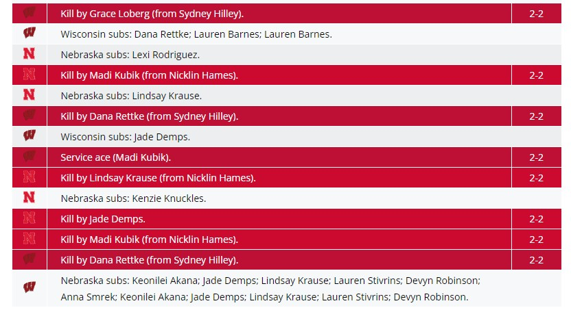
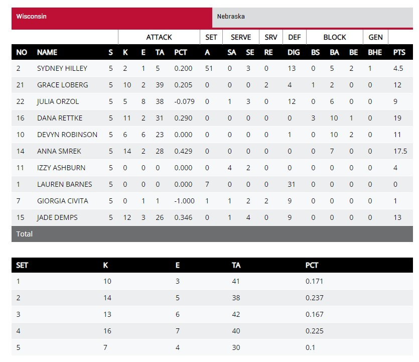
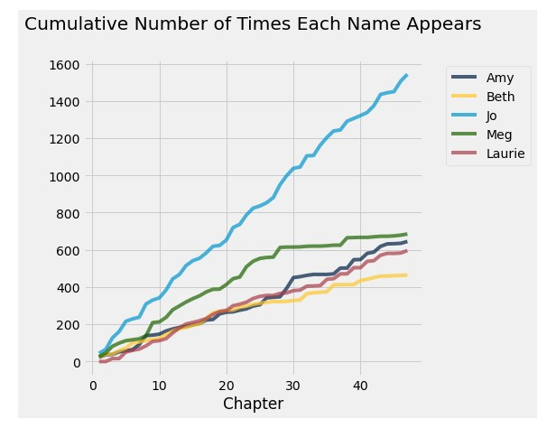
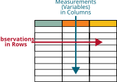

# Introduction

## What is "Data Science"?

::: r-fit-text
> "Data science combines math and statistics, specialized programming, advanced analytics, artificial intelligence (AI), and machine learning with specific subject matter expertise to uncover actionable insights hidden in an organization’s data. These insights can be used to guide decision making and strategic planning."
>
> -- [IBM Cloud Education](https://www.ibm.com/cloud/learn/data-science-introduction)
:::

## What is "Data Science"?

::: r-fit-text
> "The ability to take data — to be able to understand it, to process it, to extract value from it, to visualize it, to communicate it — that’s going to be a hugely important skill in the next decades."
>
> -- [Hal Varian](https://ischoolonline.berkeley.edu/data-science/what-is-data-science-2/), chief economist at Google and UC Berkeley Professor of Information Sciences, Business, and Economics
:::

## What is "Data Science"?

::: r-fit-text
> "Data Science draws upon multiple disciplines to develop or apply computational and analytic methods to responsibly explore data and discover actionable insights and accelerate translation into implementation with real-world evidence."
>
> -- [University of Pittsburgh Data Science Task Force](https://www.datascience.pitt.edu/what-data-science)
:::

## What is "Data Science"?

::: r-fit-text
> "Data Science is about drawing useful conclusions from large and diverse data sets through exploration, prediction, and inference.
>
> Exploration involves identifying patterns in information.
>
> Prediction involves using information we know to make informed guesses about values we wish we knew.
>
> Inference involves quantifying our degree of certainty: will the patterns that we found in our data also appear in new observations? How accurate are our predictions?
>
> Our primary tools for exploration are visualizations and descriptive statistics, for prediction are machine learning and optimization, and for inference are statistical tests and models."
>
> -- [Computational and Inferential Thinking](https://inferentialthinking.com/chapters/01/what-is-data-science.html)
:::

## Class Definition

::: r-fit-text
**Data science is the study of the collection, storage, analysis, and visualization/communication of recorded information.**

- **Collection:** how observed events and/or characteristics are recorded in ways that can be explored sometime in the future.
- **Storage:** How information is efficiently stored for later recall.
- **Analysis:** How information is processed and organized in order to predict outcomes, or make official statements, about recorded information.
- **Visualization/Communication:** How information is presented in order to communicate a message motivated by recorded information.
:::

## Data Science Life Cycle

From [R for Data Science](https://r4ds.hadley.nz/whole-game.html) by Hadley Wickham

{#fig-datascience-life-cycle fig-alt="A diagram displaying the data science cycle: Import -> Tidy -> Understand  (which has the phases Transform -> Visualize -> Model in a cycle) -> Communicate. Surrounding all of these is Program  Import, Tidy, Transform, and Visualize is highlighted."}

## Why Data Science?

[Primary Motivation:]{.emph .green-dk} Improving our ability to collect, store, analyze, and visualize information $\Rightarrow$\$\\Rightarrow\$ Improve our ability to **make better decisions.**

The ["art"]{.emph .blue-dk} of data [science]{.emph .blue-dk}

- How do we decide what to measure and how to measure it?
- How do we define what is "best"? Is our "best" ethical?
- How do we handle missing observations?

# Attendance Code

Go to Canvas and fill in the attendance code for today

# Data Examples

Data comes in all types of formats, not all of which are straightforward to handle...

## Computer Vision

Computers "see an image" as a **matrix** of pixels, where the numbers in the pixel squares represent the intensity of the color. Color images are usually represented as a set of three matrices, where each layer represents the intensity of the red, green, and blue hues respectively.

](images/tiny-lincoln.png){#fig-tiny-lincoln width="20%" fig-alt="A pixelated image of Abraham Lincoln"}

## Sound

Check out <https://soundtools.io/music-visualizer/>.

::: panel-tabset
### Bars



### Lines


:::

## Sports



The sample measurements for this exciting sequence might look something like this: `Serve2;D7;S17;A16;D8...`

## Sports

This sample string can be summarized into a [play by play](https://www.ncaa.com/game/5909463/play-by-play).

{width="100%"}

## Sports

Which can be further summarized into a [box score](https://www.ncaa.com/game/5909463).

{width="100%"}

## Sports

Which can be further summarized to simply remember [who won the game](https://www.ncaa.com/history/volleyball-women/d1).

| **Year** | **Champion (Record)** | **Coach** | **Score** | **Runner-Up** | **Site** |
|:------|:-----------|:-------------|:-------------|:-------------|:-------------|
| 2021 | [Wisconsin](https://www.ncaa.com/brackets/volleyball-women/d1/2021 "2021 DI women's volleyball championship bracket") (31-3) | Kelly Sheffield | 3-2 | Nebraska | Columbus |
| 2020 | [Kentucky](https://www.ncaa.com/brackets/volleyball-women/d1/2020) (24-1) | Craig Skinner | 3-1 | Texas | Omaha |

## Data Science Challenges

- What Level of Detail do we need to make a decision?

- How can additional detail improve the decision?

## Literature

Use "strings" of text to derive insight from literature.


```{r}
#| echo: false
#| fig-alt: "Plot of the cumulative time each name is mentioned in the literary classic, Little Women. Taken from [inferentialthinking.com](https://inferentialthinking.com/chapters/01/3/1/Literary_Characters.html)"
#| fig-width: 8
#| fig-height: 5
#| out-width: 100%
library(stringr)
library(dplyr)
library(purrr)

little_women_url = 'https://www.inferentialthinking.com/data/little_women.txt'
little_women_text = readLines(little_women_url) |>
  magrittr::extract(-c(1:94)) |> paste( collapse = " ")
little_women_chapters = str_split(little_women_text, 'CHAPTER ', simplify = F) |> unlist()

characters <- c("Amy", "Beth", "Jo", "Meg", "Laurie")

little_women <- tidyr::crossing(tibble(ch=1:length(little_women_chapters), text = little_women_chapters), tibble(character = characters)) |>
  mutate(count = map2_int(text, character, ~str_count(.x, .y))) |>
  group_by(character) |>
  arrange(ch) |>
  mutate(mentions = cumsum(count))

library(ggplot2)
theme_set(theme_bw())

ggplot(little_women, aes(x = ch, y = mentions, color = character)) + geom_line() + 
  ylab("# Mentions") + 
  xlab("Chapter") + 
  scale_color_manual(values = c("#E69F00", "#56B4E9", "#009E73", "#F0E442",  "#D55E00"))
```



## Course Focus

**Tabular** data 

{fig-alt="Table showing observations in rows and variables in columns" width="80%"}


## Course Focus

::: callout-note
### Tabular data
data in which the rows represent samples, or observations, and the columns represent variables. 
:::

```{r}
library(stat1080r)

data("cereal")

head(cereal)
```

For this, we will learn how to use R programming to keep track of the changes we make to a raw dataset. This will serve as a journal that helps us to track our data throughout the **Data Science Life Cycle.**


## Data Science Life Cycle

From [R for Data Science](https://r4ds.hadley.nz/whole-game.html) by Hadley Wickham

{#fig-datascience-life-cycle fig-alt="A diagram displaying the data science cycle: Import -> Tidy -> Understand  (which has the phases Transform -> Visualize -> Model in a cycle) -> Communicate. Surrounding all of these is Program  Import, Tidy, Transform, and Visualize is highlighted."}

# Next Time

- [Why R?](02-data.qmd)

- Introduction to Data Science activity


