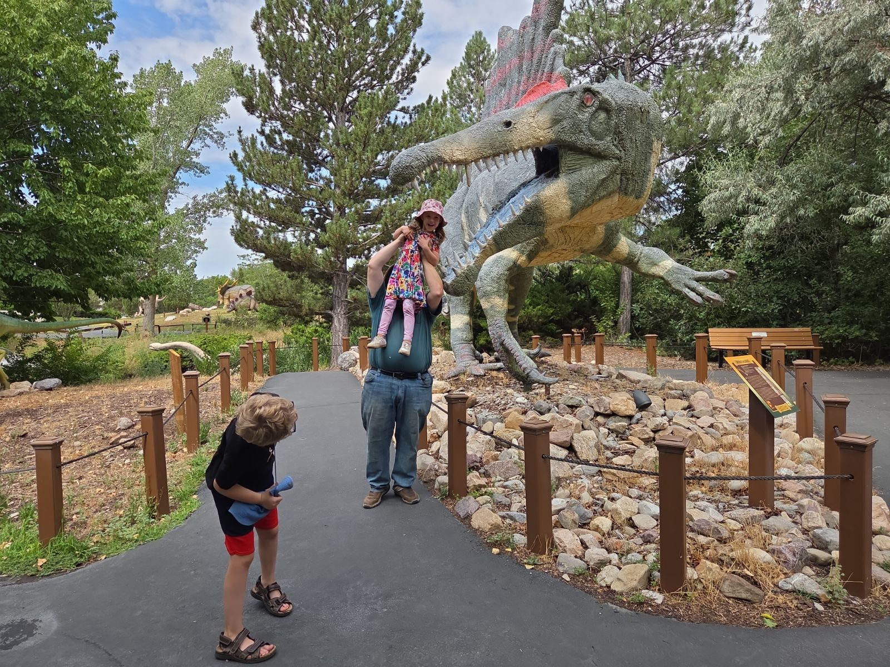
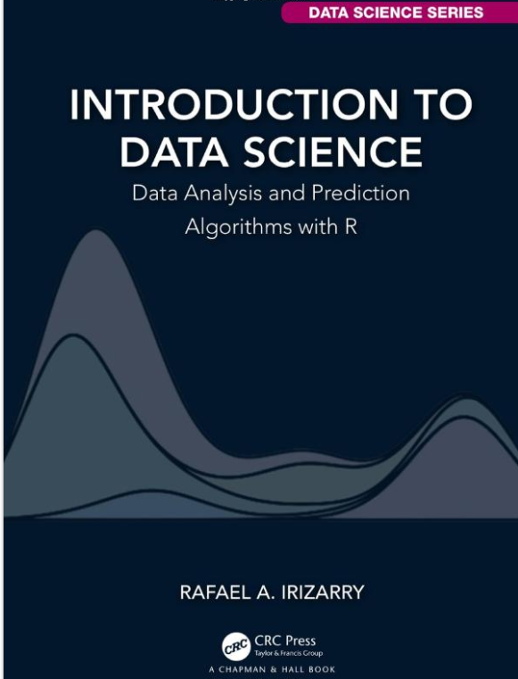
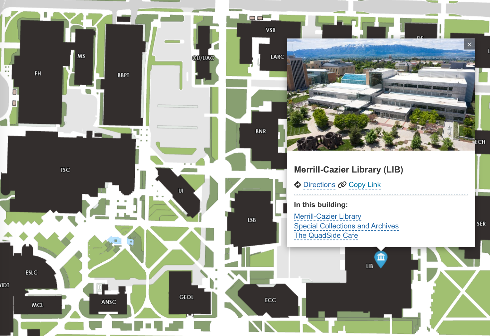
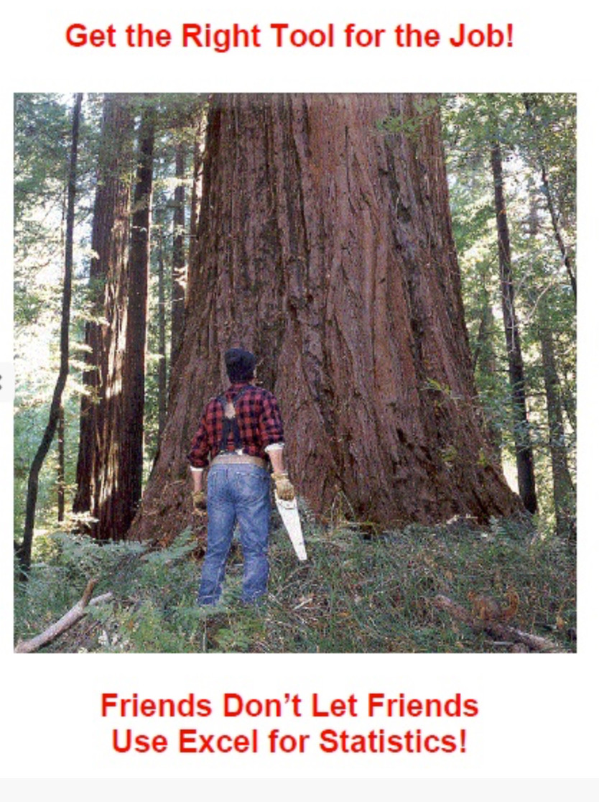

## Introductions

{fig-alt="Picture of a man feeding a small girl to a Spinosaurus statue, while a young boy ducks." width="60%"}

- New to USU - Previously an Associate Professor at University of Nebraska Lincoln

- Prosopagnosia – Face blindness 🫥

- I've been teaching R and Statistics since 2013 or so – graduate school.

## Textbooks

- Free, open, and online

{fig-alt="An image of the cover of \"Introduction to Data Science\" by Rafael A. Irizarry" width="30%"}

## Course Fee

\$30, covers Aggie Math Learning Center. 

Room 411, LIB – a short walk from here.

{fig-alt="Map of USU campus showing ESLC (class) and the Merrill Cazier Library."}

## Required Equipment

::::: columns
::: column
{fig-alt="An image from the Wizard of Oz showing the scarecrow, the tin man, Dorothy, and the lion." width="50%"}
:::

::: column
- A brain🧠, some 🫀heart❤️, and some courage🦁

- A device with a keyboard and a screen of at least 1000x1000 px

  - Install and run R/Rstudio \
    OR

  - Access the web RStudio platform in a browser
:::
:::::

## Grade

- 20% Attendance

- 20% Preparation & Participation

- 20% Personal Data Collection Project

- 40% Homework and Labs

## Attendance

- 3 excuse-free absences

- If you're sick🤒, schedule an office hours appointment to make up any absences past 3

- If something happens💥, contact me early

Checking Attendance:

- Every class has a 5-digit code quiz that is only open during class

- Sharing the code is an academic integrity violation

## Prepare for Class

- Reading should be done before class

- Reading checks close at 11 AM

  - Except for during Week 1 to allow for Add/Drop

- Do the reading check with the reading open in another tab!

- Bring your computer to *every* class!

---
::: columns
::: column

{fig-width="100%" fig-alt="A picture of a guy standing in front of a giant redwood with a handsaw, with the caption 'Friends Don't Let Friends Use Excel for Statistics'"}
:::
::: column
::: incremental

- This class has no exams, open book quizzes, four homework assignments, and a 1-3 minute presentation

    - Also a lot of low-stakes assignments to remind you to do things

- If you come to class and participate, you will succeed

:::

[(even though learning statistics and programming can be scary 👻)]{.fragment}

:::
:::

## AI 🤖

- Do ask: 
    - What does this error message mean?
    - What R function calculates the standard deviation?
- Don't ask: 
    - Analyze this data for me and write out the appropriate conclusion.

## AI 🤖

- Disclose AI use in an appendix to any assignment
- Provide the full transcript
- Be prepared to explain your work in an oral exam (whether or not AI was used)

## Finals

::: {.huge .emph .cerulean-dk}

Do NOT plan to travel during Finals Week!

:::
