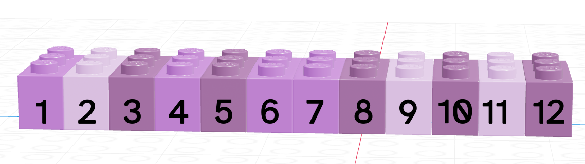
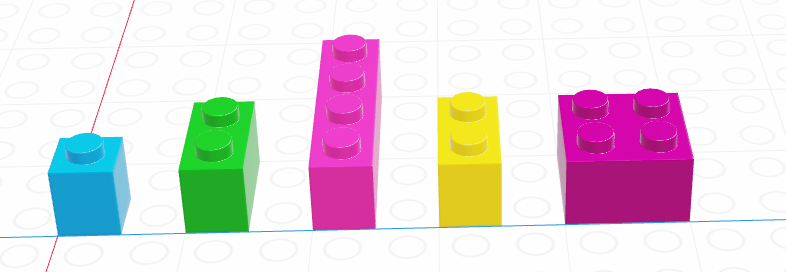
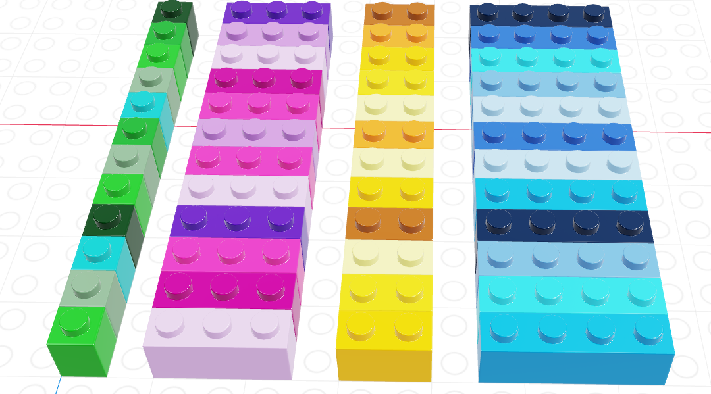

---
## Computers...

{fig-alt="An old bald man with a moustach has an index finger raised, with text 'Malicious compliance is the best compliance'" width="80%"}


## Engineers...

{fig-alt="If you ever code something that 'feels like a hack but it works' just remember that a CPU is literally a rock that we tricked into thinking - @Daisyowl tweet, 14 Mar 2017. Follow-up tweet: not to oversimplify, first you have to flatten the rock and put lightning inside it." width="60%"}


> a word of caution: if the rock thinks too hard it will become hot enough to boil water
> 
> -(Jake Chanenson, 6/17/20)

[Source](https://jakec007.github.io/2020-06-28-how-we-trick-rocks-to-think/)

Alternately...

> Computers are warm rocks we tricked into doing math and it’s a miracle they do anything.

## Teaching Rocks to do Math

::: incremental

- Remember you're talking to a rock [("dumb as a box of rocks...")]{.fragment .emph .cerulean-dk}
- You have to know a concept really well *before* you start programming
- Be extremely specific
- Consider what assumptions you are making. 
  - Try not to make them unless necessary.
  - If necessary, test to ensure they're met.

:::

## Installation/Setup

- Install R and [RStudio](https://docs.posit.co/ide/user/#rstudio-ide-oss-downloads)
- Install Quarto


## Basic Definitions

::: callout-note

### variable

A **named object** corresponding to a space in computer memory that can be assigned a **value**

:::

In R, variables are assigned using `<-`, e.g. 

```{r}
#| echo: true
x <- 5
y <- "A character variable"
```

`x` and `y` are the variable names, `5` and `"a character variable"` are the assigned values. 

```{r}
#| echo: true
x <- 6
```

Variable values can be re-assigned.


## Basic Definitions

::: callout-note
### variable type

The mode and size of the variable's stored value(s)

:::

Types can be:

- **integers** (1, 2, 3, 40932), 
- **floats** (3.1415, 2.71828), 
- **characters** ("Frank", "Evelyn", "This is a string"), or 
- **logicals** (TRUE, FALSE)

```{r}
#| echo: true
mode(x)
mode(y)
```


## Basic Definitions

::: callout-note
### variable structure

A way to arrange and store multiple data values for efficient access

:::


## Vector

::: {.callout-note .large}
### vector

a sequence of multiple values of the same type (think about a column in a spreadsheet)
:::

{fig-alt="A sequence of 12 lego 1x2 bricks in shades of purple, numbered 1 to 12 sequentially"}

## List

::: {.callout-note .large}
### list

a sequence of multiple values; these values can be of the same or different data type.
:::

{fig-alt="A sequence of five lego bricks in different sizes (1x1, 1x2, 1x4, 1x2, 2x2)."}


## Data Frame

::: {.callout-note .large}
### **data frame**

a list of vectors which all have the same length.    
(Essentially, this is a spreadsheet with strict column/row requirements)
:::

{fig-alt="A list of four vectors that all have length 12; the first has 1x1 green bricks, the second has 1x3 purple/pink bricks, the third has 1x2 yellow bricks, and the final has 1x4 blue-ish bricks."}


# Lab: Bread Programming

- [Quarto assignment file](../lab/_03-programming-sandwich.qmd)
- [HTML file - pretty version](../lab/03-programming-sandwich.qmd)


