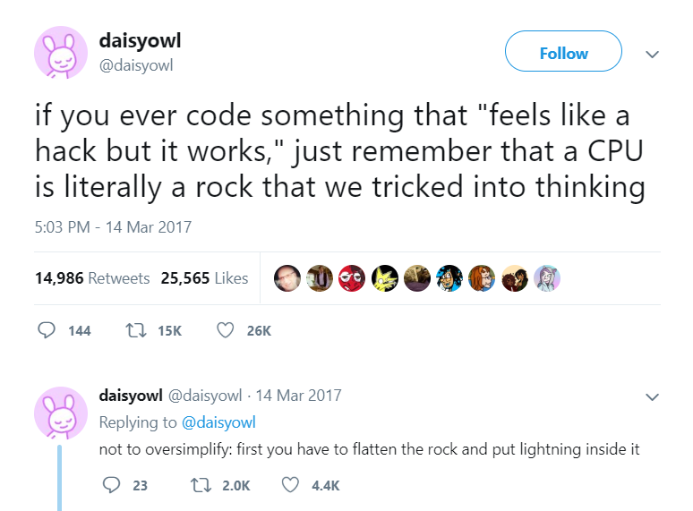

---
## Computers...

{fig-alt="An old bald man with a moustach has an index finger raised, with text 'Malicious compliance is the best compliance'" width="80%"}

## Engineers...

{fig-alt="If you ever code something that 'feels like a hack but it works' just remember that a CPU is literally a rock that we tricked into thinking - @Daisyowl tweet, 14 Mar 2017. Follow-up tweet: not to oversimplify, first you have to flatten the rock and put lightning inside it." width="60%"}

> a word of caution: if the rock thinks too hard it will become hot enough to boil water
> 
> -(Jake Chanenson, 6/17/20)

[Source](https://jakec007.github.io/2020-06-28-how-we-trick-rocks-to-think/)

Alternately...

> Computers are warm rocks we tricked into doing math and it’s a miracle they do anything.

## Teaching Rocks to do Math

::: incremental

- Remember you're talking to a rock [("dumb as a box of rocks...")]{.fragment .emph .cerulean-dk}
- You have to know a concept really well *before* you start programming
- Be extremely specific
- Consider what assumptions you are making. 
  - Try not to make them unless necessary.
  - If necessary, test to ensure they're met.

:::

# Lab: Bread Programming

- [Quarto assignment file](../lab/_03-programming-sandwich.qmd)
- [HTML file - pretty version](../lab/03-programming-sandwich.qmd)

