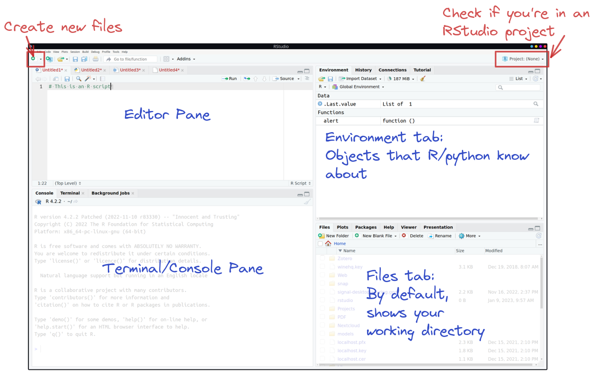
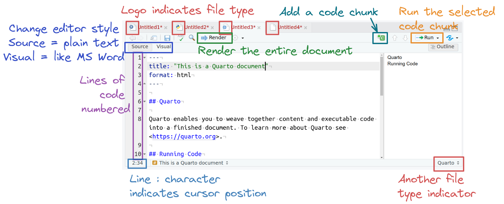
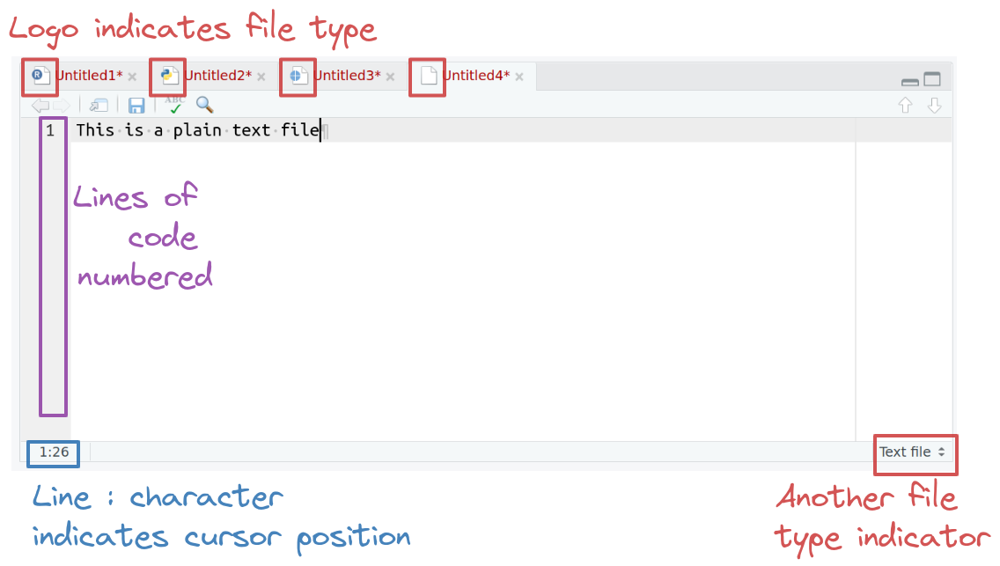
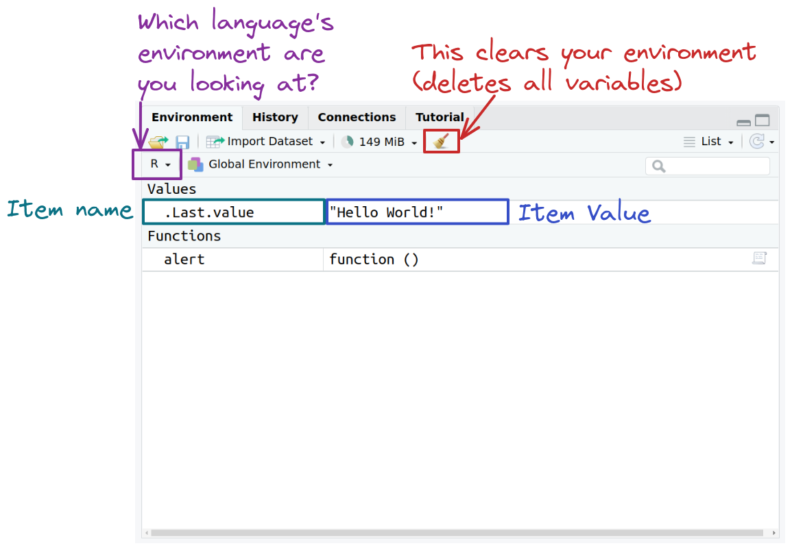
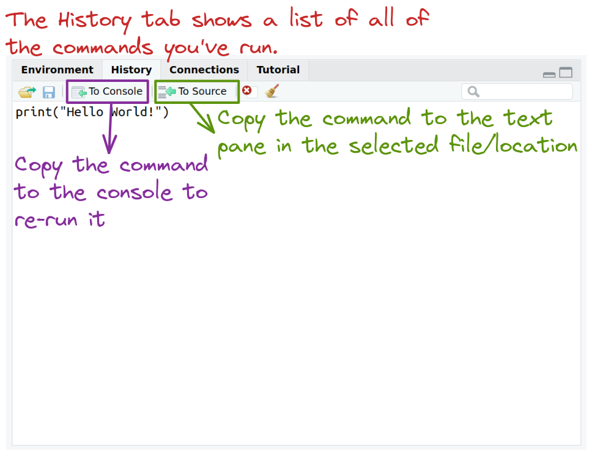
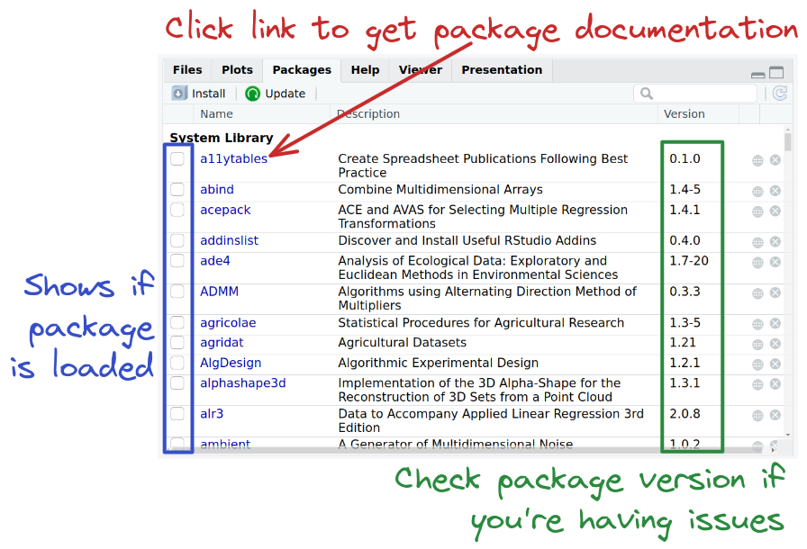
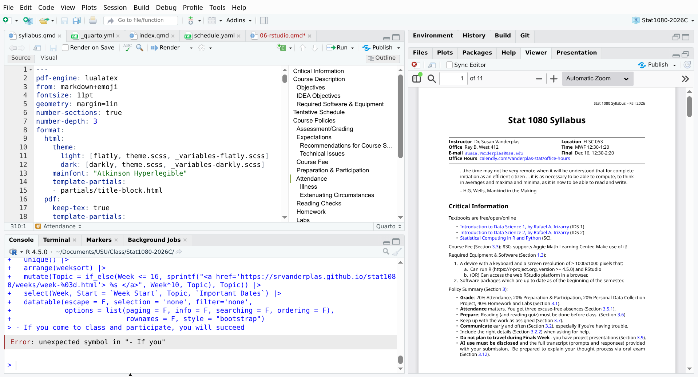

## Important Buttons

{fig-alt="A screenshot of an RStudio window highlighting buttons for creating new files (top left), opening an RStudio project (top right). The main portion of the window shows the four panes in a default RStudio interface. The editor pane (top left), contains text files that may contain R or python code. The terminal/console pane (bottom left), contains the R console, system terminal, and a tab for background jobs. The top right pane contains the environment, history, connections, and tutorial tabs by default, and may also contain tabs labeled build and git, depending on your project setup. The environment tab shows you what objects are currently in your programming environment - that is, what things are defined. The bottom right pane contains the files, plots, packages, help, viewer, and presentation tabs. By default, the files tab will show you your current working directory; if you are not working in a project, then it will show your home directory, which is the default working directory."}

## The File Editor (Top Left)

{fig-alt="Screenshot of the RStudio editor window in R script mode. Lines are numbered along the left side. Editor style can be toggled between source and visual mode. There is a run button at the top to run the current or selected line(s), and an additional shortcut to source the script. An indicator in the bottom right tells you what kind of file you are looking at. In the bottom left, you can see the line:character that is being edited."}

::: {.notes}

The logo on the script file indicates the file type.

When an R file is open, there are Run and Source buttons on the top which allow you to run selected lines of code (Run) or source (run) the entire file. 

Code line numbers are provided on the left (this is a handy way to see where in the code the errors occur), and you can see line:character numbers at the bottom left.

At the bottom right, there is another indicator of what type of file Rstudio thinks this is.

:::

## The File Editor (Top Left)

{fig-alt="Screenshot of the RStudio editor window in quarto markdown mode. Lines are numbered along the left side. Editor style can be toggled between source and visual mode. There is a render button at the top to run the whole document, and additional shortcuts to add code chunks and run the selected code chunk. An indicator in the bottom right tells you what kind of file you are looking at. In the bottom left, you can see the line:character that is being edited."}

::: {.notes}

The logo on the script file indicates the file type. 

When a quarto markdown file is open, there is a render button at the top which allows you to compile the file to see its "pretty", non-markup form. 

In the same toolbar, there are buttons to add a code chunk as well as to run a selcted line of code or chunk of code. 

You can toggle between source (shown) and visual mode to see a more word-like rendering of the quarto markdown file. 

Code line numbers are provided on the left (this is a handy way to see where in the code the errors occur), and you can see line:character numbers at the bottom left.

At the bottom right, there is another indicator of what type of file Rstudio thinks this is.

:::

## The File Editor (Top Left)

{fig-alt="Screenshot of the RStudio editor window in text mode. Lines are numbered along the left side. Editor style can be toggled between source and visual mode. An indicator in the bottom right tells you what kind of file you are looking at. In the bottom left, you can see the line:character that is being edited."}

::: {.notes}

The logo on the text file indicates the file type. 

When a text file (or other unknown file extension) is open, there are very few buttons in the editor window. 

Code line numbers are provided on the left (this is a handy way to see where in the code the errors occur), and you can see line:character numbers at the bottom left. 

At the bottom right, there is another indicator of what type of file Rstudio thinks this is.

:::

## The Console Pane (Bottom Left)

{fig-alt="Screenshot of the RStudio console. Notice that there is an icon indicating what language the console is currently running."}

::: {.notes}
When running R code from a script file, the console will show you that you are running in R by the logo at the top of the console pane. 

You will initially see lines indicating that you're running R (they're missing here because this isn't the first command I ran in this session). 

The command you ran will appear after `>`, and the results will appear immediately below, with boxed numbers in front of each sequential line. 

A `>` waits for a new command. 

In the environment pane, you may see a new value pop up named `.Last.value` - this is part of user settings and you can stop it from appearing if you want to.

:::

## Environment Tab (Top Right)

{fig-alt="Screenshot of the environment pane. There is an indicator of which language's environment is shown, a way to clear the environment, and pairs of variable names and values."}

::: {.notes}

The environment tab shows you all of the objects in memory that the language you're working in knows about.

:::

## History Tab (Top Right)

{fig-alt="RStudio history pane. This pane preserves all commands that have been run from the console or from evaluating code cells or scripts."}

::: {.notes}

The history tab shows you a list of all commands you've run and allows you to send them to the console or to source (the text editor).

:::

## Files Tab (Bottom Right)

{fig-alt="Screenshot of RStudio file tab, showing files, size, and last modified date. The folder path is shown just below the icon row and can be useful if you don't know where your files are located."}

::: {.notes}

The files tab shows you the files in your current working directory (by default), though you can navigate through it and find other files as necessary.

If you want to return to your working directory, there's a button for that in the "More" menu. 

One of the most important pieces of information in this pane is your path - you can construct the file path by using ~/ for home, and then for each folder, adding a slash between. The path to the folder we're looking at here is thus `~/Projects/Class/stat-computing-r-python/`.

:::

## Packages Tab (Bottom Right)

{fig-alt="Packages tab of RStudio. Checkboxes in the far left column show whether packages are loaded. Links to the package name can be clicked to access package documentation. The 3rd column is the package version, which should be verified and updated if you're having issues with the package's functions."}

::: {.notes}

You can get important information from the packages tab, like what packages are loaded, easy access to documentation for each package, and what version of the package is installed.

:::

## Help tab (Bottom Right)

{fig-alt="Screenshot of RStudio help tab. Search bar is highlighted and annotated with 'search for function name here', and then the main window is annotated with 'Documentation appears here'."}

::: {.notes}

The help tab makes it easy to get access to function documentation within Rstudio, so you don't have to switch windows.

:::

## The Viewer Tab (Bottom Right)

{fig-alt="A screenshot of RStudio showing the Viewer tab, which displays HTML and PDF documents compiled from quarto or Rmarkdown."}

::: {.notes}

The Viewer tab is where you will preview quarto documents -- which is how you will submit some labs and homework assignments in this class. 

You should *always* preview your documents before submitting them to make sure they look correct.

You can also set a specific quarto document to open in a browser or in the system PDF viewer.

:::

