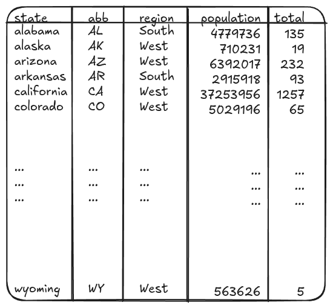
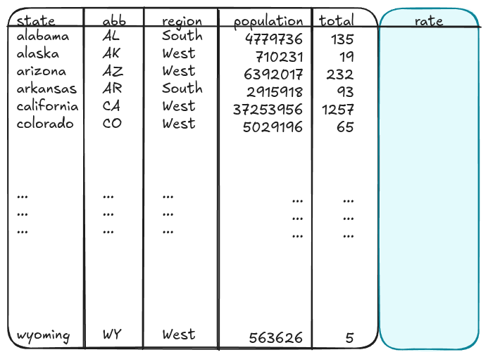
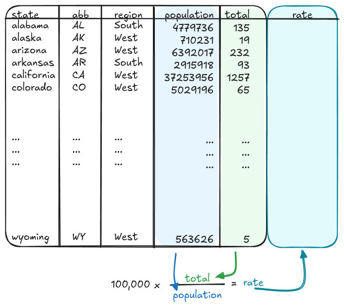
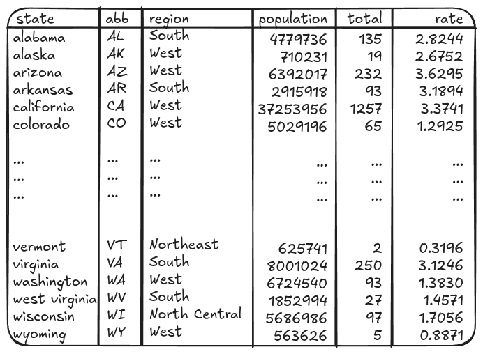
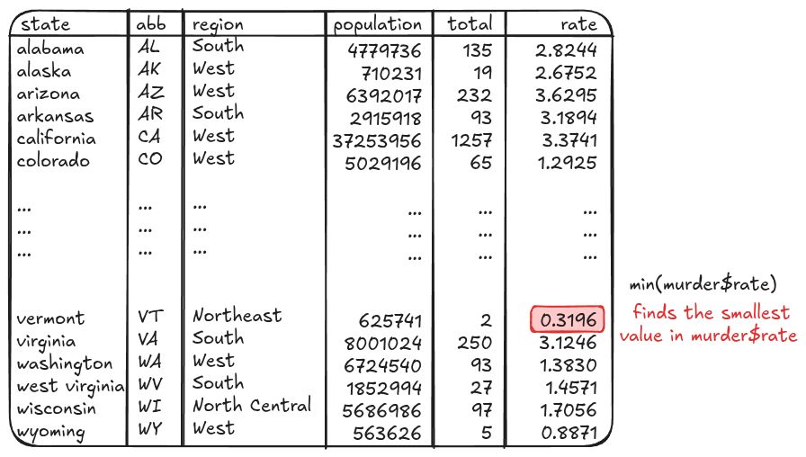
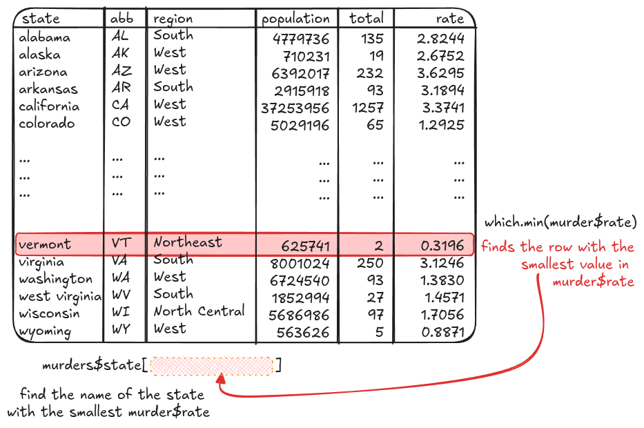
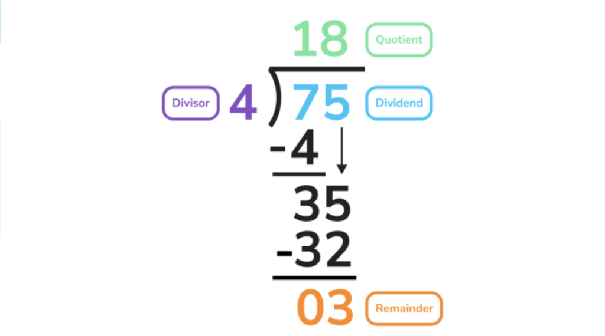
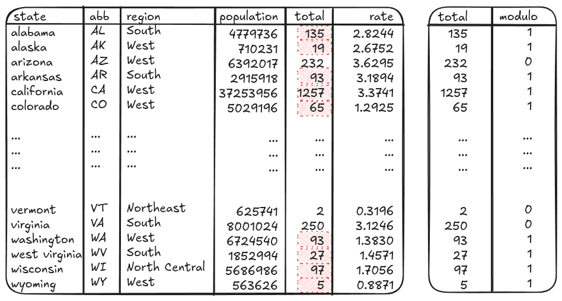
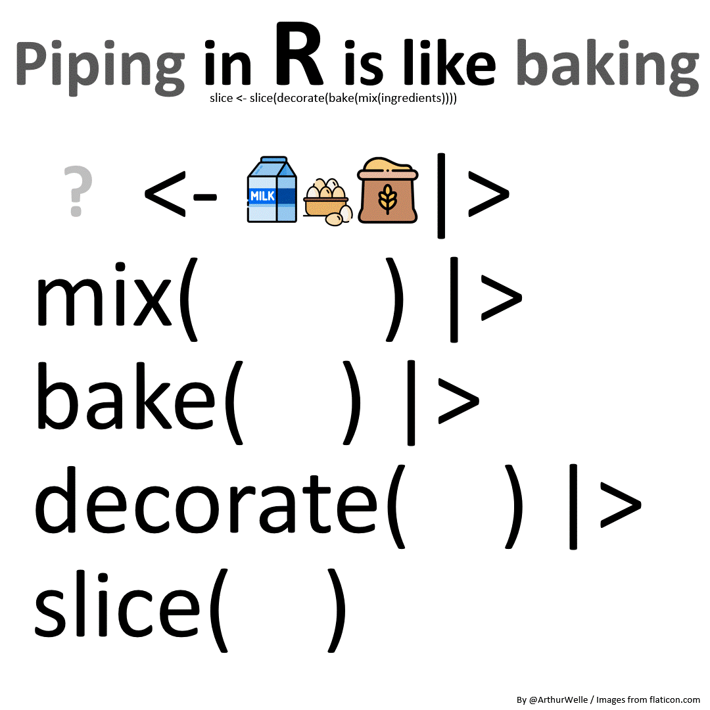

# Programming Basics

## Adding A Column To A Data Frame
### Calculating Murder Rates

::: columns
::: column

```{r}
#| echo: true
library(dslabs) # <1>
data(murders) # <2>
murders[c(1:6, 51),] # <3>
```
1. Load the `dslabs` package
2. Load the `murders` data from the `dslabs` package
3. Show the first 6 and last 1 rows of the `murders` data

::: 
::: column

{fig-alt="An image of the first 6 rows + last row of the murders data, showing columns state, abb, region, population, and total, with corresponding values for alabama, alaska, arizona, arkansas, california, colorado, and wyoming"}
:::
:::

## Adding A Column To A Data Frame
### Calculating Murder Rates

{fig-alt="An image of the first 6 rows + last row of the murders data, showing columns state, abb, region, population, and total, with corresponding values for alabama, alaska, arizona, arkansas, california, colorado, and wyoming. A rate column is shown appended to the data table, in teal"}

## Adding A Column To A Data Frame
### Calculating Murder Rates

{fig-alt="An image of the first 6 rows + last row of the murders data. A rate column is shown appended to the data table, in teal. The population column is highlighted in blue, and the total column is highlighted in green. Below the table, (100,000) x total / population = rate is shown, with each variable in its matching color (green, blue, teal respectively). Arrows point from each column to the respective variable. Constants (100,000) and mathematical operators (x, /, =) are shown in black. "}

## Adding A Column To A Data Frame
### Calculating Murder Rates

{fig-alt="An image of the first 6 rows + last 6 rows of the murders data. columns state, abb, region, pouplation, total, and rate are shown."}

## Adding A Column To A Data Frame
### Calculating Murder Rates

```{r}
#| echo: true
murders$rate <- murders$total / murders$population * 100000 # <1>
```
1. Create a column named rate by dividing the total number of murders in a state by the state's population. Then, multiply by 100k because it's easier to interpret rates when they're scaled to not be so small.

::: small
```{r}
knitr::kable(murders[c(1:6, 46:51),], digits = 4)
```
:::

## Finding Rows in a Data Frame
### Calculating Murder Rates

```{r}
#| echo: true

min(murders$rate) # <1>
```
1. This tells us the value of the minimum murder rate


{fig-alt="An image of the first 6 rows + last 6 rows of the murders data, showing columns state, abb, region, population, total, and rate, with corresponding values for alabama, alaska, arizona, arkansas, california, colorado, vermont, virginia, washington, west virginia, wisconsin, and wyoming. Text next to the table says 'min(murder$rate)' in black, and in red underneath, 'finds the smallest value in murder$rate'. The corresponding minimum murder rate is highlighted in red."}

## Finding Rows in a Data Frame
### Calculating Murder Rates


```{r}
#| echo: true
which.min(murders$rate) # <1>
murders$state[which.min(murders$rate)] # <2>
```
1. This tells us the row of the minimum murder rate
2. Using the row, we can then get which state is in that row.

{fig-alt="An image of the first 6 rows + last 6 rows of the murders data, showing columns state, abb, region, population, total, and rate, with corresponding values for alabama, alaska, arizona, arkansas, california, colorado, vermont, virginia, washington, west virginia, wisconsin, and wyoming. Text next to the table says 'which.min(murder$rate)' in black, and in red underneath, 'finds the row with the smallest value in murder$rate'. The corresponding full row is highlighted in red." width="70%"}


## Doing Math With Columns
### Number of Even/Odd Values

{fig-alt="A long division problem (75 divided by 4) with the parts labeled: 4 is the divisor, 75 is the dividend, 18 is the quotient, 3 is the remainder. The problem shows the 7-4 step, where the remainder is 35, and then shows 35-32 = 03 for the remainder."}

## Doing Math With Columns
### Number of Even/Odd Values

::: huge

**Modular Division** (%% in R) provides the remainder value
$$\begin{array}{rl}
3\ \%\%\  2 &= 1\\    
153\  \%\%\  5 &= 3\\    
24\  \%\%\  2 &= 0\\
\end{array}$$
:::


## Doing Math With Columns
### Number of Even/Odd Values

```{r}
#| echo: true
#| output-location: column-fragment

tmp <- data.frame(
  total = murders$total, # <1>
  modulo = murders$total %% 2 # <2>
)
tmp[c(1:6,46:51),]
```
1. Original value for comparison
2. Modular division by 2. Odd values show up as 1, even values show up as 0.

{fig-alt="An image of the first 6 rows + last 6 rows of the murders data, showing columns state, abb, region, population, total, and rate, with corresponding values for alabama, alaska, arizona, arkansas, california, colorado, vermont, virginia, washington, west virginia, wisconsin, and wyoming. Total values which are odd are highlighted in red. A second table is shown next to the first, with just columns total and modulo. The total column is the same as previously shown, and the modulo column has 1 if the value in total is odd, 0 if it is even." width="65%"}


## Doing Math With Columns
### Number of Even/Odd Values


```{r}
#| echo: true
tmp <- data.frame(
  total = murders$total,
  modulo = murders$total %% 2 
)
sum(tmp$modulo==0) # <1>
sum(tmp$modulo) # <2>
```
1. Calculating the number of even values by testing for whether modulo is 0
2. Calculating the number of odd values by adding up modulo results. We could also test for modulo==1 or modulo != 0 (modulo is nonzero) and get equivalent results. 


## Doing Math With Columns
### Taking Columns to a Power
Suppose we know that the number of person-to-person interactions is proportional to the number of people ($n$) squared (e.g. $n^2$)

::: columns
::: {.column width='70%'}
```{r}
#| echo: true

murders$interactions <- murders$population^2 # <1>

with(murders, cor(total, population)) # <2>
with(murders, cor(total, interactions)) # <3>
```
1. Square the population and store the result in a column named `interactions`
2. Calculate the correlation of murders with population. `with()` allows me to refer to the columns of the data frame without using the name of the data frame first -- it's here to save space.
3. Calculate the correlation of murders with interactions.  `with()` allows me to refer to the columns of the data frame without using the name of the data frame first -- it's here to save space.

:::
::: {.column width="30%"}
```{r}
#| fig-width: 4
#| fig-height: 8
#| fig-alt: "A plot with two panels - the first shows the interactions (e.g. the population squared) and its relationship with murders. The second shows the population and its relationship with murders."
library(ggplot2)
library(dplyr)
library(tidyr)
murders |>
  pivot_longer(c(population, interactions)) |>
  ggplot(aes(x = value, y = total)) + 
  geom_point() + 
  facet_wrap(~name, ncol = 1, scales = "free_x") + 
  geom_smooth(method = "lm", se = F) + 
  theme_bw() + 
  ylab("# Murders") + 
  xlab("")
```
:::
:::

## Pipes

R functions are sometimes nested:
```{r}
#| echo: true
mean(na.omit(murders$population))
```

::: incremental

- Too many nested functions in a row can be hard to read

- **pipes** allow us to "chain" functions together into a "recipe" of steps to take

:::

## Pipes

{fig-alt="A gif showing ingredients being piped into a mix function. The batter from the mix function is then piped into a bake function. The bake function outputs a cake, which is then piped into a decorate function, and the resulting decorated cake is piped into a slice function, which is assigned to cake slice at the top. "}

[Pipes are essential to working with tidyverse functions]{.emph .large .sage-dk .fragment}


# Preview: The Tidyverse

{width="50%" align="center" fig-alt="A hexagon covered in tiny hexagons that has the text 'tidyverse'."}

## The Tidyverse

- a set of packages to make it easy to work with data 
- use the same structure: `function(data, ...)`
- work nicely with pipes `|>` and `%>%`     
(these are essentially the same, with very minor differences)


## `dplyr`
::: columns
::: column

{width="80%"}

::: 
::: column
- modify and summarize data frames
- 5 main verbs:
  - `filter` - get a set of rows
  - `select` - get a set of columns
  - `mutate` - make a new column
  - `arrange` - sort the rows by one or more variables
  - `summarize` - collapse a data frame into a single row with specified columns
    - mostly used with `group_by` - split data by one/more variables, then summarize, then recombine

:::
:::

## `tidyr`

::: columns
::: column

{width="80%"}

:::
::: column
- reshape and reorganize data frames
- `pivot_wider` and `pivot_longer` for rectangle reorganization
- `separate_wider_...` and `separate_longer_...` to split a variable into multiple columns or rows
- `crossing` and `nesting` to build data frames with combinations of values
- `nest` and `unnest` to put data frames (or lists) into columns or pull them back out
:::
:::

