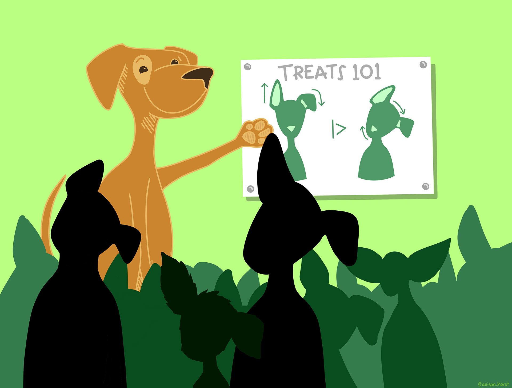
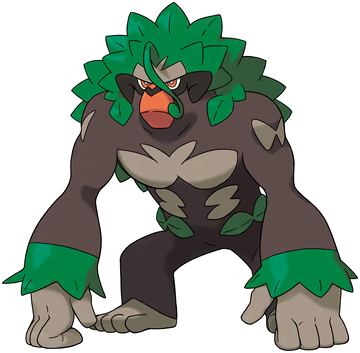
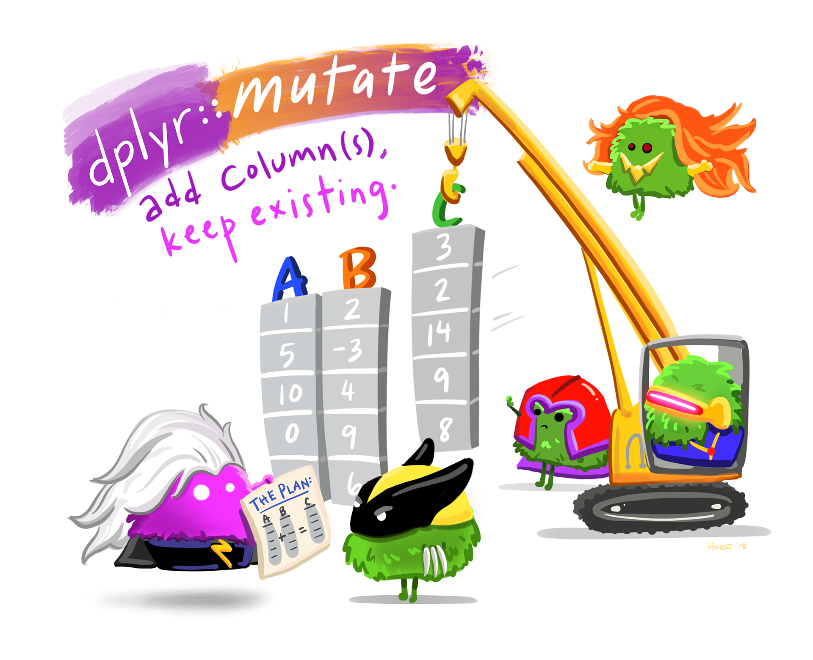

# Review: Pipes

## Pipes

R functions are sometimes nested:
```{r}
#| echo: true

data(midwest, package = "ggplot2") # <1>
head(midwest[midwest$state == "WI", 1:6]) # <2>
wi_pop <- sum(midwest[midwest$state == "WI", ]$poptotal) # <3>
```
1. Load midwest data from the ggplot2 package
2. Show the first few rows of Wisconsin data, but only the first 6 columns (to save space on the slide)
3. Get the `poptotal` column from that data, and sum up all of the county-level values to get a single state-level value. Store the result in `wi_pop`

::: incremental

- Too many nested functions (or operations) in a row can be hard to read

- **pipes** allow us to "chain" functions together into a "recipe" of steps to take

:::


## Pipes

{fig-alt="A cartoon dog teaches a group of other dogs how to beg for treats. On a sign they are pointing at is a picture of a dog, showing step 1: drop one ear, then (|>) rotate your head for max cuteness." width="80%"}

[Pipes are essential to working with tidyverse functions]{.emph .large .sage-dk .fragment}

## Pipes + `dplyr` Setup
```{r}
#| echo: true
library(dplyr) # <1>
library(tibble) # <1>
data(midwest, package = "ggplot2") # <2>
midwest <- as_tibble(midwest) # <3>
head(midwest)
```
1. Load the dplyr and tibble packages
2. Load the midwest data from the ggplot2 package
3. Convert to a tibble (fancy data frame) so that output looks similar in base as in tidyverse

## Pipes + `dplyr` 
::: panel-tabset

### "Base" R

```{r}
#| echo: true
tmp1 <- midwest[, 1:6] # <1>
tmp1 <- midwest[midwest$state == "WI", 1:6] # <2>

head(tmp1)

wi_pop <- sum(midwest[midwest$state == "WI", ]$poptotal) # <3>
wi_pop
```
1. Get the first 6 columns of the data
2. Get the rows corresponding to wisconsin
3. Add up the population total for each county, since we only have rows from Wisconsin

### `dplyr`
```{r}
#| include: false

library(magrittr)
```

```{r}
#| echo: true
tmp1 <- midwest |>
  select(1:6) |> # <1>
  filter(state == "WI") # <2>

head(tmp1)

tmp1 |>
  summarize(poptotal = sum(poptotal)) # <3>
```
1. Get the first 6 columns of the data
2. Get the rows corresponding to wisconsin
3. Summarize across all rows (since it's only WI data at this point) and add up the population total for each county

:::


# Tidy Data

{fig-alt="Stylized text providing an overview of Tidy Data. The top reads “Tidy data is a standard way of mapping the meaning of a dataset to its structure. - Hadley Wickham.” On the left reads “In tidy data: each variable forms a column; each observation forms a row; each cell is a single measurement.” There is an example table on the lower right with columns ‘id’, ‘name’ and ‘color’ with observations for different cats, illustrating tidy data structure."}


# Messy Data

{fig-alt="There are two sets of anthropomorphized data tables. The top group of three tables are all rectangular and smiling, with a shared speech bubble reading “our columns are variables and our rows are observations!”. Text to the left of that group reads “The standard structure of tidy data means that “tidy datasets are all alike…” The lower group of four tables are all different shapes, look ragged and concerned, and have different speech bubbles reading (from left to right) “my column are values and my rows are variables”, “I have variables in columns AND in rows”, “I have multiple variables in a single column”, and “I don’t even KNOW what my deal is.” Next to the frazzled data tables is text “...but every messy dataset is messy in its own way. -Hadley Wickham.”"}

# Common Data Cleaning Tasks

## Setting up: Read In Some Data
```{r}
#| include: false
#| eval: true

set.seed(2930472)
```

```{r}
#| echo: true
library(readr) # <1>
library(dplyr) # <1>
library(tidyr) # <1>

poke <- read_csv("https://bit.ly/poke-data") # <2>

# Scramble the rows - easier to see what each operation does to the data
new_row_order <- sample( # <3>
  x = 1:nrow(poke), # <3>
  size = nrow(poke), replace = F # <3>
) # <3>

poke <- poke[new_row_order, ] # <4>
poke_types <- separate(poke, type, c("type1", "type2"), sep = ",") # <5>
poke_short <- poke[, c(1, 2, 4:8, 14:16)] # <6>
head(poke_short) # <7>
```
1. Load the `readr` package for the `read_csv` function, and the dplyr package (for everything else we're going to do later)
2. Read in the CSV using the short bit.ly URL (to make it easier to follow along in class)
3. Scramble the row order so that you can see what different operations do to the data, by listing out the number of rows in the data (`1:nrow(poke)`) and sampling without replacement from those rows (`sample(..., ))
4. Rearrange rows in the shuffled order
5. Create a data frame that splits type into two columns (before the comma, after the comma) -- this will be used for Your Turns.
6. Take a smaller subset of the columns to make it easier to display -- exclude the image URL and some specific stats like attack, defense, sp_attack, sp_defense, and speed that are relevant for battle calculations.
7. Preview the data


## Get Rows Matching A Condition

{fig-alt="Cartoon showing three fuzzy monsters either selecting or crossing out rows of a data table. If the type of animal in the table is “otter” and the site is “bay”, a monster is drawing a purple rectangle around the row. If those conditions are not met, another monster is putting a line through the column indicating it will be excluded. Stylized text reads “dplyr::filter() - keep rows that satisfy your conditions.” [Learn more about dplyr::filter.](https://dplyr.tidyverse.org/reference/filter.html)"}

## Filter: Get Rows Matching A Condition

- `df |> filter(...)`
- `...` replaced by a logical condition involving a variable
- keep only rows where that condition is true

::: panel-tabset

### By Generation
```{r}
#| echo: true
poke_short |>
  filter(gen == 1) |> # <1>
  head()
```
1. Get rows where the pokemon are in the first generation

### By Height

```{r}
#| echo: true
poke_short |>
  filter(height_m > 2) |> # <2>
  head()
```
2. Get rows where the pokemon is taller than 2 meters

### By Multiple Conditions

```{r}
#| echo: true
poke_short |>
  filter(height_m < .5, weight_kg > 40) |> # <3>
  head()
```
3. Get rows where the pokemon is shorter than 0.5 meters and weighs more than 40 kg

### Only NAs

```{r}
#| echo: true
poke_short |>
  filter(is.na(variant)) |> # <4>
  head()
```
4. Get rows where `variant` is NA (missing)

### Removing NAs

```{r}
#| echo: true
poke_short |>
  filter(!is.na(variant)) |> # <5>
  head()
```
5. Get rows where `variant` is NOT NA

:::


## Your Turn: Filter {.inverse}

Using the original `poke` data, get Pokemon matching the following criteria:

::: columns
::: column

1. Pokedex number between 800 and 900
2. Grass type
3. Attack stats of more than 100

{fig-alt="An image of the pokemon Rillaboom" .fragment}
:::
::: column
::: fragment
```{r}
#| echo: true
tmp <- poke |> 
  filter(pokedex_no >= 800, 
         pokedex_no <= 900, 
         type == "Grass", 
         attack > 100)
tmp$name
```
:::
:::
:::

## Get (or Remove) Some of the Columns

- Pick out columns: 
  - `df |> select(...)`
  - `...` replaced by names or indices/positions of a variable
  - keep only columns that are mentioned
  - Remove columns by putting `-c(...)` around columns to eliminate

::: panel-tabset
### Positive Selection

```{r}
#| echo: true
poke |>
  select(1, 2, 4:8, 14:16) |>
  head()
```

### Negative Selection

```{r}
#| echo: true
poke |>
  select(-c(3, 9:13)) |>
  head()
```

### Compare to Base R
```{r}
#| echo: true

poke[, c(1, 2, 4:8, 14:16)] |>
  head()
```

:::

## Get (or Remove) Some of the Columns

- Pick out columns: `df |> select(...)`
- Select helpers can help get the right columns
  - `matches(...)`, e.g. `matches("year")` will get all variables that have "year" in the name
    - `starts_with(...)`, `ends_with(...)`
  - `where(is.XXX)` e.g. `where(is.numeric)` will get all numeric variables
  - `any_of()`, `all_of()` will match variables to names stored in a vector. `any_of()` gets anything that matches, `all_of()` will error if something is not found
  - `everything()` gets all variables
  - `last_col()` gets the last column


## Get (or Remove) Some of the Columns
### Select Helpers

::: panel-tabset

### Matches
```{r}
#| echo: true
poke |>
  select(-matches("img|attack|defense|speed")) |>
  head()
```

### Any_Of
```{r}
#| echo: true
battle_stats <- c("attack", "defense", "sp_attack", "sp_defense", "speed")

poke |>
  select(-any_of(battle_stats), -img_link) |>
  head()
```


### Last_col()
```{r}
#| echo: true
poke |>
  select(1:2, name, type, height_m:last_col()) |>
  head()
```

### Where + is.numeric
```{r}
#| echo: true
poke |>
  select(where(is.numeric)) |>
  head()
```
:::


## Your Turn: Select {.inverse}

Using the original `poke` data, get only columns matching any of the following criteria:

::: columns
::: column

1. columns starting with `t`
2. the 9th column
3. the pokemon name

:::
::: column
```{r}
poke |> select(starts_with('t'), 9, name)
```

:::
:::


## Your Turn: Select {.inverse}
Using the original `poke` data, get only columns matching any of the following criteria:

::: columns
::: column

1. columns starting with `t`
2. the 9th column
3. the pokemon name

:::
::: column
```{r}
#| echo: true
poke |> 
  select(starts_with('t'), 
         9, 
         name)
```

:::
:::


## Create New Variables

{fig-alt="Cartoon of cute fuzzy monsters dressed up as different X-men characters, working together to add a new column to an existing data frame. Stylized title text reads “dplyr::mutate - add columns, keep existing.” [Learn more about dplyr::mutate.](https://dplyr.tidyverse.org/reference/mutate.html)"}


## Create New Variables

- Create new variables: 
  - `df |> mutate(newvar= XXX(...))`
  - XXX can be any function
  - use 'bare' column names (not `df$variable_name` -- just `variable_name`)
  - `...` provides arguments to the function

```{r}
#| echo: true
poke_short <- poke_short |>
  mutate(
    bmi = weight_kg / (height_m^2),
    weight_lbs = weight_kg * 2.204623
  )

poke_short |>
  select(-c(variant, species)) |>
  head()
```

## Your Turn: Mutate {.inverse}

Create a column named `n_elevator` that calculates how many of these pokemon could fit in an elevator with a weight limit of 6000 lbs. 

Round your answer down to the nearest integer with the `floor()` function - no one needs to get hurt!

::: fragment

```{r}
#| echo: true
poke_short |>
  select(gen, name, type, weight_lbs) |>
  mutate(n_elevator = floor(6000/weight_lbs))
```

:::

## Sort Rows By Variable Values

- Arrange/sort rows by the value of one or more columns
- `desc()` is a helper function used within `arrange` to indicate descending order

```{r}
#| echo: true

poke_short |>
  arrange(desc(bmi), desc(height_m)) |>  # <1>
  select(-c(variant, species)) |> # <2>
  unique() |> # <3>
  head()
```
1. Arrange by BMI in descending order. Break any ties in BMI by sorting in descending order by height as a secondary variable.
2. Remove variant and species (to save room)
3. Get rid of duplicate rows (e.g. different variants of the same pokemon that have the same stats)


## Group Rows and Do Something By Group

- [Split]{.large .emph .cerulean-dk}: Group rows into sub-tables
- [Apply]{.large .emph .cerulean-dk}:  Perform an operation on each sub table
- [Combine]{.large .emph .cerulean-dk}: Put resulting sub-tables back together into a single table

::: panel-tabset

### Original Data

```{r}
poke_short |> 
  select(gen, pokedex_no, name, type, height_m) |>
  print(n = 50)
```

### Split By Gen
`poke_short |> group_by(gen)`

```{r}
#| echo: false
tmp <- poke_short |> 
  select(gen, pokedex_no, name, type, height_m) |> 
  unique()  |> 
  arrange(gen) |>
  group_by(gen) 

lst <- list()
for(i in unique(poke_short$gen)) {
  lst[[i]] <- tmp |> filter(gen == i)
}
lst
```

### Apply a Function

`poke_short |> group_by(gen) |> mutate(height_gen_rank = order(height_m))`

```{r}
#| echo: false
lst <- list()
for(i in unique(poke_short$gen)) {
  lst[[i]] <- tmp |> filter(gen == i) |> mutate(height_gen_rank = order(height_m))
}
lst
```

### Recombine

```{r}
#| echo: false
poke_short |> 
  select(gen, pokedex_no, name, type, height_m) |> 
  unique() |> 
  group_by(gen) |>
  mutate(height_gen_rank = order(height_m)) |> 
  ungroup() |> 
  print(n = 50)
```

:::


## Group Rows and Summarize

- Group by + summarize: 
  - `df |> group_by(varname) |> summarize(newvar = XXX(...))` 
  - One row returned per group (e.g. per value of `varname`)
  - All non-grouping variables dropped unless defined in `summarize`
  - One level of grouping is removed

```{r}
#| echo: true

poke_short |>
  group_by(gen) |> # <0>
  summarize(
    n_entries = n(),                     # <1>
    n_species = length(unique(species)), # <2>
    hp_mean = mean(hp),                  # <3>
    height_m_max = max(height_m),        # <4>
    weight_kg_min = min(weight_kg),      # <5>
    bmi_median = median(bmi)             # <6>
  )
```
0. Group by generation
1. Get the total number of rows in the group
2. Get the number of different species in the group
3. Calculate the average hp for all pokemon in the group
4. Calculate the maximum height for the pokemon in the group
5. Calculate the minimum weight for all pokemon in the group
6. Calculate the median BMI for all pokemon in the group


## Group Rows and Summarize

- Group by + summarize: 
  - `df |> group_by(varname) |> summarize(newvar = XXX(...))` 
  - One row returned per group (e.g. per value of `varname`)
  - All non-grouping variables dropped unless defined in `summarize`
  - One level of grouping is removed

## Grouping by Type

```{r}
#| echo: true
poke_types |>
  group_by(gen, type1) |> # <1> 
  summarize(n = n(), hp = mean(hp)) |> # <2>
  ungroup() |> # <3>
  head()
```
1. Group by generation and type1
2. Calculate the number of pokemon with each type combination, and the mean HP for each type combination
3. Remove any remaining grouping variables

## Group Rows and Summarize

With a bit of `tidyr` magic... (next time)

::: {.small}

```{r}
options(knitr.kable.NA = '-')
poke_types |>
  group_by(gen, type1) |>
  summarize(n = n()) |> 
  ungroup() |> 
  tidyr::pivot_wider(names_from = gen, values_from = n) |>
  relocate(Primary = type1, everything()) |>
  knitr::kable()
```
:::


## Your Turn: Group_by + Summarize! {.inverse}

Work with `poke_types` and only worry about the primary type (`type1`)

1. Calculate the total number of bug pokemon in each generation
2. Find the heaviest pokemon of each type, making sure to remove any duplicate rows. 
3. Find the pokemon with the highest HP for each generation. Include all tied rows.

## Your Turn: Group_by + Summarize! {.inverse}

Work with `poke_types` and only worry about the primary type (`type1`)


1. [Calculate the total number of bug pokemon in each generation]{.cerulean-lt}
2. Find the heaviest pokemon of each type, making sure to remove any duplicate rows.
3. Find the pokemon with the highest HP for each generation. Include all tied rows. 


::: fragment
```{r}
poke_types |>
  group_by(gen) |>
  summarize(Bug = sum(type1 == "Bug"))
```

:::


## Your Turn: Group_by + Summarize! {.inverse}

1. Calculate the total number of bug pokemon in each generation
2. [Find the heaviest pokemon of each type, making sure to remove any duplicate rows.]{.cerulean-lt}
3. Find the pokemon with the highest HP for each generation. Include all tied rows.

::: fragment
```{r}
poke_types |>
  select(gen, name, type1, weight_kg) |> 
  unique() |>
  group_by(type1) |>
  filter(weight_kg == max(weight_kg)) |>
  ungroup()
```

:::

## Your Turn: Group_by + Summarize! {.inverse}

1. Calculate the total number of bug pokemon in each generation
2. Find the heaviest pokemon of each type, making sure to remove any duplicate rows.
3. [Find the pokemon with the highest HP for each generation. Include all tied rows.]{.cerulean-lt}

::: fragment
```{r}
poke_types |>
  select(gen, name, hp) |> 
  unique() |>
  group_by(gen) |>
  filter(hp == max(hp)) |>
  ungroup() |>
  arrange(gen)
```

:::
