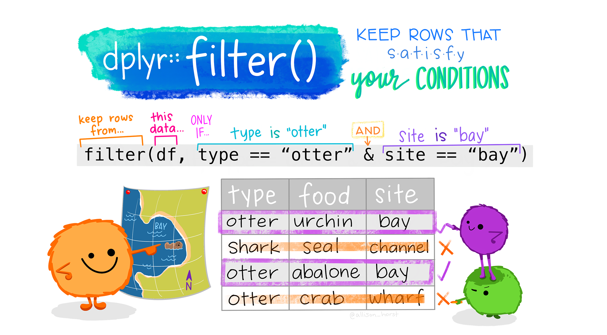

## Pipes

R functions are sometimes nested:
```{r}
#| echo: true

data(midwest, package = "ggplot2") # <1>
head(midwest[midwest$state=="WI",1:6]) # <2>
wi_pop <- sum(midwest[midwest$state=="WI",]$poptotal) # <3>
```
1. Load midwest data from the ggplot2 package
2. Show the first few rows of Wisconsin data, but only the first 6 columns (to save space on the slide)
3. Get the `poptotal` column from that data, and sum up all of the county-level values to get a single state-level value. Store the result in `wi_pop`

::: incremental

- Too many nested functions (or operations) in a row can be hard to read

- **pipes** allow us to "chain" functions together into a "recipe" of steps to take

:::

## Pipes

{fig-alt="A gif showing ingredients being piped into a mix function. The batter from the mix function is then piped into a bake function. The bake function outputs a cake, which is then piped into a decorate function, and the resulting decorated cake is piped into a slice function, which is assigned to cake slice at the top. " width="70%"}

[Pipes are essential to working with tidyverse functions]{.emph .large .sage-dk .fragment}

## Pipes + `dplyr`

Today, we're going to turn this code into something more readable:
```{r}
#| echo: true
#| eval: false

data(midwest, package = "ggplot2") # <1>
head(midwest[midwest$state=="WI",1:6]) # <2>
wi_pop <- sum(midwest[midwest$state=="WI",]$poptotal) # <3>
```

```{r}
library(dplyr)
midwest |> 
  select(1:6) |>  # <1> 
  filter(state == "WI") # <2>

midwest |>
  filter(state == "WI") |> # <2>
  summarize(poptotal = sum(poptotal)) # <3>
```
1. Get the first 6 columns of the data
2. Get the rows corresponding to wisconsin
3. Summarize across all rows (since it's only WI data at this point) and add up the population total for each county

## Tidy Data

{fig-alt="Stylized text providing an overview of Tidy Data. The top reads “Tidy data is a standard way of mapping the meaning of a dataset to its structure. - Hadley Wickham.” On the left reads “In tidy data: each variable forms a column; each observation forms a row; each cell is a single measurement.” There is an example table on the lower right with columns ‘id’, ‘name’ and ‘color’ with observations for different cats, illustrating tidy data structure."}


## Messy Data

{fig-alt="There are two sets of anthropomorphized data tables. The top group of three tables are all rectangular and smiling, with a shared speech bubble reading “our columns are variables and our rows are observations!”. Text to the left of that group reads “The standard structure of tidy data means that “tidy datasets are all alike…” The lower group of four tables are all different shapes, look ragged and concerned, and have different speech bubbles reading (from left to right) “my column are values and my rows are variables”, “I have variables in columns AND in rows”, “I have multiple variables in a single column”, and “I don’t even KNOW what my deal is.” Next to the frazzled data tables is text “...but every messy dataset is messy in its own way. -Hadley Wickham.”"}

## Setting up: Read In Some Data

```{r}
#| echo: true
library(readr)
library(dplyr)

poke <- read_csv("https://bit.ly/poke-data")
# https://github.com/srvanderplas/datasets/raw/main/clean/pokemon_gen_1-9.csv

head(poke)
```

## Common Data Cleaning Tasks

{fig-alt="Cartoon showing three fuzzy monsters either selecting or crossing out rows of a data table. If the type of animal in the table is “otter” and the site is “bay”, a monster is drawing a purple rectangle around the row. If those conditions are not met, another monster is putting a line through the column indicating it will be excluded. Stylized text reads “dplyr::filter() - keep rows that satisfy your conditions.” Learn more about dplyr::filter."}

## Common Data Cleaning Tasks
### Filter - Pick certain rows

- `df |> filter(...)`
- `...` replaced by a logical condition involving a variable
- keep only rows where that condition is true

```{r}
poke |> filter()
```


## Common Data Cleaning Tasks

- Pick out columns: 
  - `df |> select(...)`
  - `...` replaced by names or indices/positions of a variable
  - keep only columns that are mentioned
  - Remove columns by putting `-c(...)` around columns to eliminate

## Common Data Cleaning Tasks

- Pick out columns: `df |> select(...)`
- Select helpers can help get the right columns
  - `matches(...)`, e.g. `matches("year")` will get all variables that have "year" in the name
    - `starts_with(...)`, `ends_with(...)`
  - `where(is.XXX)` e.g. `where(is.numeric)` will get all numeric variables
  - `any_of()`, `all_of()` will match variables to names stored in a vector. `any_of()` gets anything that matches, `all_of()` will error if something is not found
  - `everything()` gets all variables
  - `last_col()` gets the last column


## Common Data Cleaning Tasks


- Create new variables: 
  - `df |> mutate(newvar= XXX(...))`
  - XXX may be `transform`, `replace`, or another function
  - `...` provides arguments to the function
  
  

## Common Data Cleaning Tasks

- Group by + summarize: 
  - `df |> group_by(varname) |> summarize(newvar = XXX(...))` 
  - One row returned per group (e.g. per value of `varname`)
  - All non-grouping variables dropped unless defined in `summarize`

