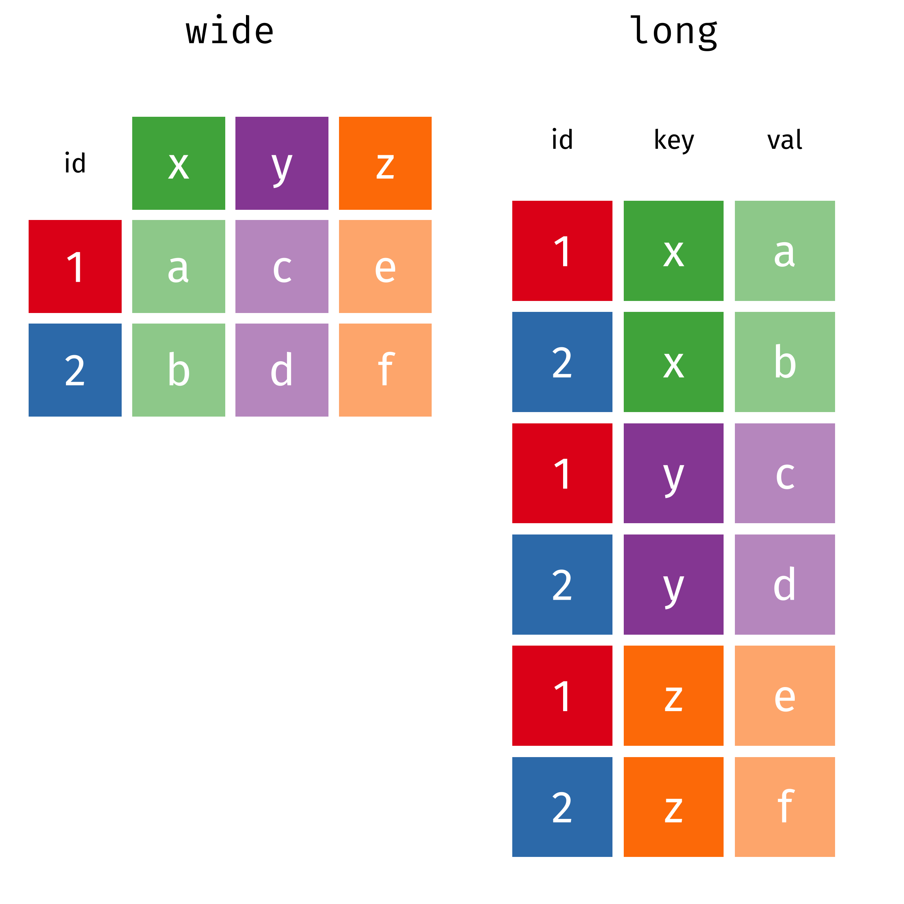
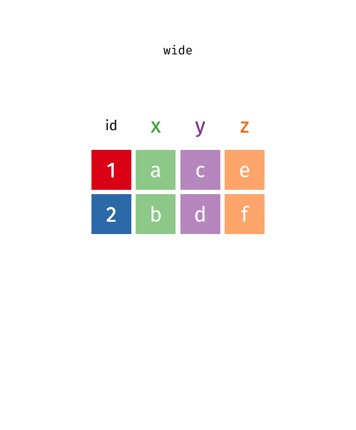
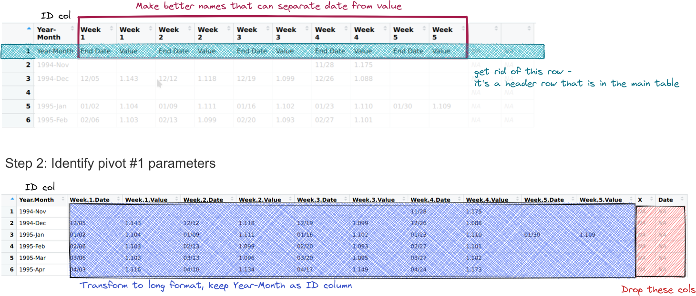
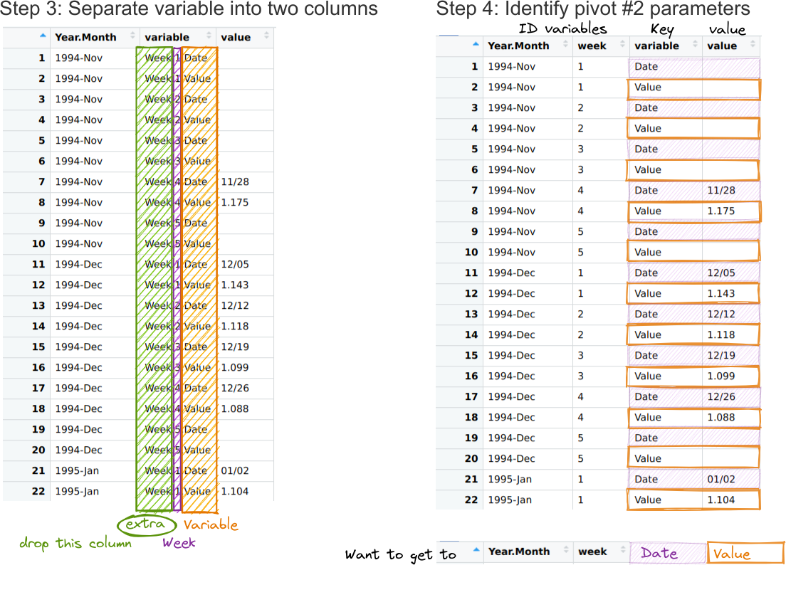
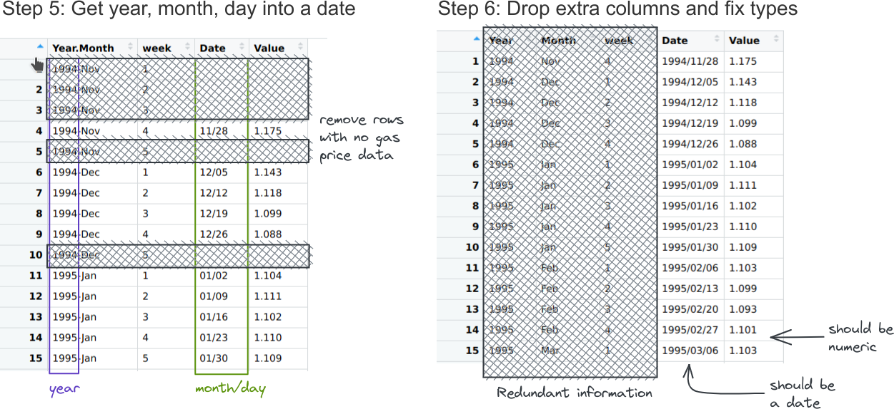

# Tidy Data

{fig-alt="Stylized text providing an overview of Tidy Data. The top reads “Tidy data is a standard way of mapping the meaning of a dataset to its structure. - Hadley Wickham.” On the left reads “In tidy data: each variable forms a column; each observation forms a row; each cell is a single measurement.” There is an example table on the lower right with columns ‘id’, ‘name’ and ‘color’ with observations for different cats, illustrating tidy data structure."}


# Messy Data

{fig-alt="There are two sets of anthropomorphized data tables. The top group of three tables are all rectangular and smiling, with a shared speech bubble reading “our columns are variables and our rows are observations!”. Text to the left of that group reads “The standard structure of tidy data means that “tidy datasets are all alike…” The lower group of four tables are all different shapes, look ragged and concerned, and have different speech bubbles reading (from left to right) “my column are values and my rows are variables”, “I have variables in columns AND in rows”, “I have multiple variables in a single column”, and “I don’t even KNOW what my deal is.” Next to the frazzled data tables is text “...but every messy dataset is messy in its own way. -Hadley Wickham.”"}

## Messy Data Examples

```{r}
#| label: tidypkgs
#| message: false
#| include: false
library(dplyr) # Data wrangling
library(tidyr) # Data rearranging
library(tibble) # data table
```


- TB cases documented by the WHO in Afghanistan, Brazil, and China, between 1999 and 2000. 
- There are 4 variables: country, year, cases, and population

::: panel-tabset
### Tidy Data 

::: columns
::: column

```{r}
#| label: tidy1
#| echo: false
knitr::kable(table1, caption = "Table 1")
```

:::
::: column

- Each observation is a row
- Each variable is a column
- Everything is nicely arranged
- Easy to compute new variables

{fig-alt="Two fuzzballs hold up a tidy data set locked in clamps that say 'wrangle'"}
:::
:::

### Long Form

::: columns
::: {.column .small}

```{r}
#| label: tidy2
#| echo: false
knitr::kable(table2, caption = "Table 2")
```

:::
::: {.column .small}

- `type` and `count` contain info for two variables
- each observation takes up 2 rows
- easier to **plot**: separate panels for cases & population with a single command


```{r}
#| echo: true
#| eval: false
#| fig-width: 5
#| fig-height: 3
#| out-width: 100%

library(ggplot2)
table2 |> 
  ggplot(aes(x = year, y = count, # <1>
             color = country)) +  # <2>
  geom_line() + # <3>
  facet_wrap(~type, # <4>
             scales = "free_y") # <5>
```
1. put year on the x-axis, count on the y-axis
2. compute and draw separate shapes (with different colors) for each country
3. draw lines connecting sequential observations
4. create plots for each value of type
5. each plot should have its own y-scale (since cases are much smaller than the population)


:::
:::

### Shared Columns

::: columns
::: {.column .small}

```{r}
#| label: tidy3
#| echo: false
knitr::kable(table3, caption = "Table 3")
```

:::
::: column

- rate contains cases and population
- rate isn't numeric! (we can't do any math on it in this form)
- easier to record data in (maybe)?

:::
:::

### Multiple Tables

::: columns
::: {.column .small}

```{r}
#| label: tidy4
#| echo: false
knitr::kable(table4a, caption = "Table 4a")
knitr::kable(table4b, caption = "Table 4b")
```

:::
::: column

- two tables - one for population, one for cases
- each year's observation in a separate column
- often found in Excel (different sheets)
- Need to make a column for year with the population or case counts, then merge

:::
:::


### Variable in Multiple Columns

::: columns
::: {.column .small}

```{r}
#| label: tidy5
#| echo: false
knitr::kable(table5, caption = "Table 5")
```

:::
::: column

- Excel messes up dates
- Easier to store Month, Day, Year (maybe Century) separately
- Combine `century` and `year`, split `rate` as in Table 3

:::
:::

:::


## Converting Between Wide and Long Form

::: {layout-ncol=2}

{fig-alt="Two data tables. The first is labeled 'wide' and has rows id=1, 2 and columns x, y, and z, with values a, b, c, d, e, f in row-first order (so a, b are in column x and rows with id 1, 2 respectively). The second is labeled 'long' and has columns id, key, and value, where id contains 3 replicates of 1, 2, key contains x, x, y, y, z, z, and val contains a, b, c, d, e, f. " width="90%"}

{fig-alt="An animation that shows the conversion between wide and long form using pivot_wider and pivot_longer commands from tidyr. pivot_wider(data, names_from = key, values_from = val) is used to move from long to wide form, and pivot_longer(data, cols = x:y, names_to = \"key\", values_to = \"val\") is used to move from wide to long form." width="100%"}

:::

[Images from <https://github.com/gadenbuie/tidyexplain>]{.bottom}

## Example: Gas Prices

```{r}
#| echo: true
library(rvest) # <1> scrape data from the web
library(xml2) # <2> parse xml data
library(tidyr) # <3>
library(dplyr) # <4>
url <- "https://www.eia.gov/dnav/pet/hist/LeafHandler.ashx?n=pet&s=emm_epm0u_pte_nus_dpg&f=w"

htmldoc <- read_html(url) # <5>
gas_prices_html <- html_table(htmldoc, fill = T, trim = T)[[5]][,1:11] # <6>
head(gas_prices_html, 10)
```
1. Library to scrape data from the web
2. Library for parsing XML data
3. Load `tidyr` for demonstration
4. Load `dplyr` to work with data frames
5. Read HTML from the URL
6. Parse the table and convert to a data frame


## Sketch

{fig-alt="Step 1: set row names to be more descriptive and remove header row. Step 2: Remove empty columns and pivot to long form, with dates and values in the same column and a description column that indicates what type of data is in the value column."}

## Sketch

{fig-alt="Step 3: separate the week and variable information into different columns, discarding the week label. Step 4: pivot wider, so that date and value information are each in a single column." width="80%"}


## Sketch

{fig-alt="Step 5: remove rows with no values and create a yyyy-mm-dd format date. Step 6: Convert date and value into appropriate types (date, numeric)." width="80%"}


## Example: Gas Prices

```{r}
#| echo: true

col_names <- c("Year.Month", # <1>
               paste("Week", # <2>
                     rep(1:5, each = 2), # <2>
                     rep(c("Date", "Value"), times = 5), sep = ".")) # <2>
library(magrittr) # <3>

gas_prices_raw <- gas_prices_html |>
  set_names(col_names) |> # <4>
  filter(Year.Month != "Year-Month") |> # <5>
  filter(Year.Month != "") # <6>

head(gas_prices_raw)
```
1. The first column name is differently structured than the others
2. Create a vector of names that are patterned after the column structure -- repeat 1 to 5 with each number twice, e.g. 1, 1, 2, 2, 3, 3, 4, 4, 5, 5, and then repeat Date, Value five times, e.g. Date, Value, Date, Value, ...
3. Load the magrittr package, which contains some helpful functions for working with pipes and data - in this case, set_names
4. Set the names of the columns in the data to be col_names
5. Remove the first row that is really an extra header row
6. Get rid of any empty rows.

## Example: Gas Prices

```{r}
#| echo: true
gas_prices_long <- pivot_longer(
  gas_prices_raw, 
  -Year.Month, # <1>
  names_to = "variable", # <2> 
  values_to = "value" # <3>
)

head(gas_prices_long)
```
1. We don't want to change `Year.Month` at all (yet)
2. We need to keep track of what is a date and what is a value
3. Value information should be kept in a `value` column. We'll use it in a bit to pivot into a wider form.

## Example: Gas Prices

```{r}
#| echo: true
#| 
gas_prices_long <- gas_prices_long |>
  filter(value != "") # <1>

gas_prices_sep <- gas_prices_long |>
  separate(variable, into = c("extra", "week", "variable"), sep = "\\.") |> # <2>
  select(-extra) |> # <3>
  mutate(week = as.numeric(week)) # <4>

head(gas_prices_sep)
```
1. Remove empty rows from `gas_prices_long`
2. Separate variable into "week", week number, and "variable" (either "Date" or "Value")
3. We don't need a column that only has value "Week", so get rid of it. 
4. Convert week to numeric


## Example: Gas Prices

```{r}
#| echo: true
#| 
gas_prices_wide <- pivot_wider(
  gas_prices_sep, 
  id_cols = c("Year.Month", "week"), # <1> 
  names_from = variable, # <2>
  values_from = value) # <3>

head(gas_prices_wide)
```
1. Columns to keep
2. Which column should be used to make new column labels?
3. Which column should be used to fill in the values?


## Example: Gas Prices

```{r}
#| echo: true
#| 
gas_prices_date <- gas_prices_wide |>
  filter(nchar(Value) > 0) |> # <1>
  separate(Year.Month, into = c("Year", "Month"), sep = "-") |> # <2>
  mutate(Date = paste(Year, Date, sep = "/")) |> # <3>
  select(-c(1:3)) # <4>
  
head(gas_prices_date)
```
1. Remove any value rows with no characters
2. Split year.month into two columns
3. create a date column with year, month, day
4. Remove redundant information


## Example: Gas Prices
```{r}
#| echo: true
#| 
library(lubridate) # Dates and Times -- we will see this next week
library(ggplot2)

gas_prices <- gas_prices_date |>
  mutate(Date = ymd(Date),
         Price.per.gallon = as.numeric(Value)) |>
  select(-Value) 

head(gas_prices)
```

## Example: Gas Prices

And at the end, we get a nice reward!
```{r}
#| echo: true
ggplot(gas_prices, aes(x = Date, y = Price.per.gallon)) + geom_line()
```

