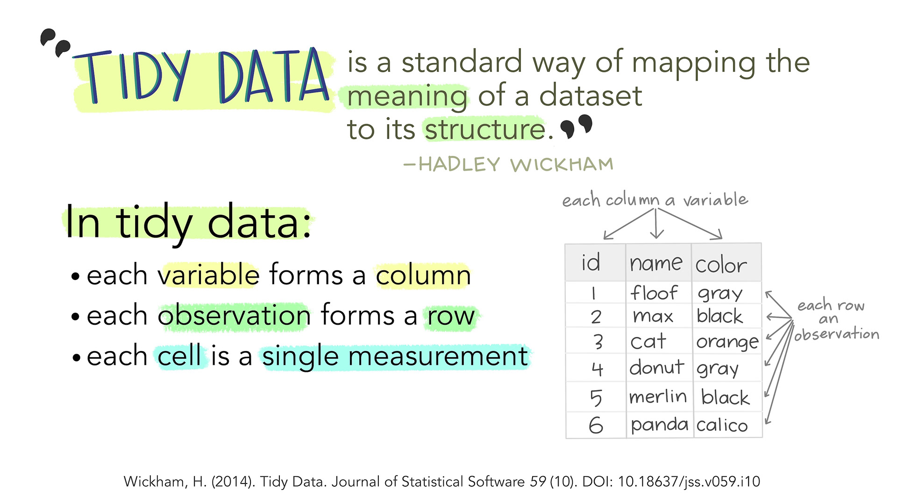
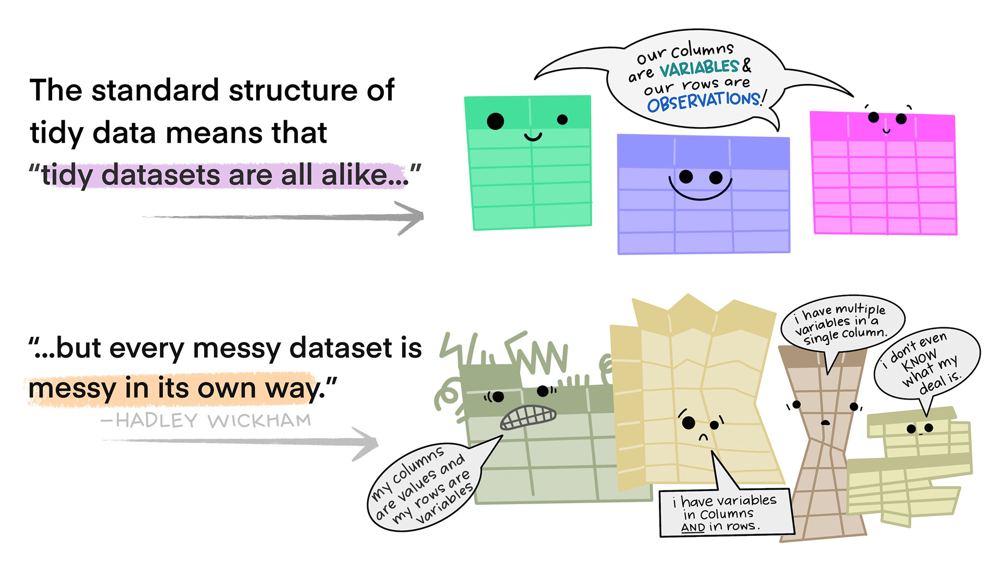

# Tidy Data

{fig-alt="Stylized text providing an overview of Tidy Data. The top reads “Tidy data is a standard way of mapping the meaning of a dataset to its structure. - Hadley Wickham.” On the left reads “In tidy data: each variable forms a column; each observation forms a row; each cell is a single measurement.” There is an example table on the lower right with columns ‘id’, ‘name’ and ‘color’ with observations for different cats, illustrating tidy data structure."}


# Messy Data

{fig-alt="There are two sets of anthropomorphized data tables. The top group of three tables are all rectangular and smiling, with a shared speech bubble reading “our columns are variables and our rows are observations!”. Text to the left of that group reads “The standard structure of tidy data means that “tidy datasets are all alike…” The lower group of four tables are all different shapes, look ragged and concerned, and have different speech bubbles reading (from left to right) “my column are values and my rows are variables”, “I have variables in columns AND in rows”, “I have multiple variables in a single column”, and “I don’t even KNOW what my deal is.” Next to the frazzled data tables is text “...but every messy dataset is messy in its own way. -Hadley Wickham.”"}

## Messy Data Examples

```{r}
#| label: tidypkgs
#| message: false
#| include: false
library(dplyr) # Data wrangling
library(tidyr) # Data rearranging
library(tibble) # data table
```


- TB cases documented by the WHO in Afghanistan, Brazil, and China, between 1999 and 2000. 
- There are 4 variables: country, year, cases, and population

::: panel-tabset
### Tidy Data 

::: columns
::: column

```{r}
#| label: tidy1
#| echo: false
knitr::kable(table1, caption = "Table 1")
```

:::
::: column

- Each observation is a row
- Each variable is a column
- Everything is nicely arranged
- Easy to compute new variables

{fig-alt="Two fuzzballs hold up a tidy data set locked in clamps that say 'wrangle'"}
:::
:::

### Long Form

::: columns
::: {.column .small}

```{r}
#| label: tidy2
#| echo: false
knitr::kable(table2, caption = "Table 2")
```

:::
::: {.column .small}

- `type` and `count` contain info for two variables
- each observation takes up 2 rows
- easier to **plot**: separate panels for cases & population with a single command


```{r}
#| echo: true
#| eval: false
#| fig-width: 5
#| fig-height: 3
#| out-width: 100%

library(ggplot2)
table2 |> 
  ggplot(aes(x = year, y = count, # <1>
             color = country)) +  # <2>
  geom_line() + # <3>
  facet_wrap(~type, # <4>
             scales = "free_y") # <5>
```
1. put year on the x-axis, count on the y-axis
2. compute and draw separate shapes (with different colors) for each country
3. draw lines connecting sequential observations
4. create plots for each value of type
5. each plot should have its own y-scale (since cases are much smaller than the population)


:::
:::

### Shared Columns

::: columns
::: {.column .small}

```{r}
#| label: tidy3
#| echo: false
knitr::kable(table3, caption = "Table 3")
```

:::
::: column

- rate contains cases and population
- rate isn't numeric! (we can't do any math on it in this form)
- easier to record data in (maybe)?

:::
:::

### Multiple Tables

::: columns
::: {.column .small}

```{r}
#| label: tidy4
#| echo: false
knitr::kable(table4a, caption = "Table 4a")
knitr::kable(table4b, caption = "Table 4b")
```

:::
::: column

- two tables - one for population, one for cases
- each year's observation in a separate column
- often found in Excel (different sheets)
- Need to make a column for year with the population or case counts, then merge

:::
:::


### Variable in Multiple Columns

::: columns
::: {.column .small}

```{r}
#| label: tidy5
#| echo: false
knitr::kable(table5, caption = "Table 5")
```

:::
::: column

- Excel messes up dates
- Easier to store Month, Day, Year (maybe Century) separately
- Combine `century` and `year`, split `rate` as in Table 3

:::
:::

:::

