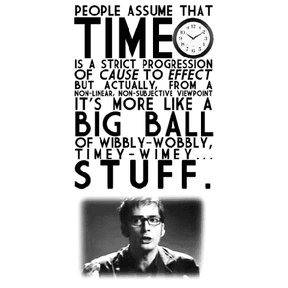
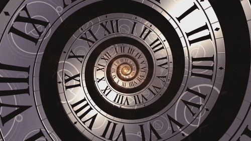
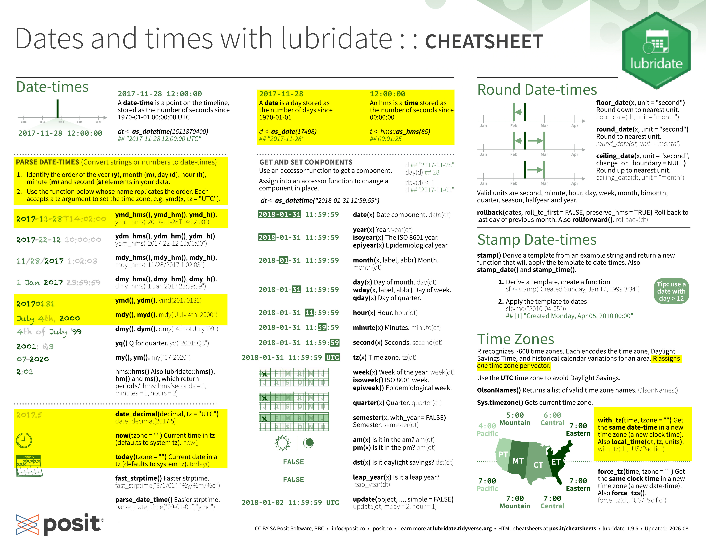
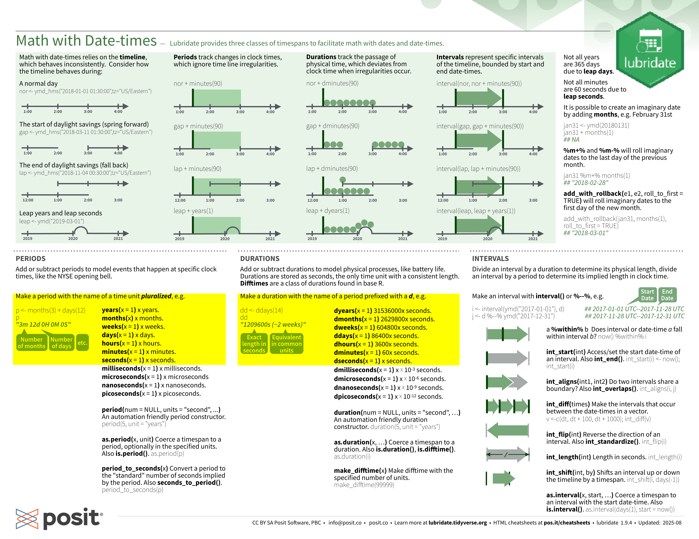

# Why is Time So Hard?
::: {layout-ncol=2}

{fig-alt="People assume that time is a strict progression of cause to effect, but actually, from a non-linear, non-subjective viewpoint it's more like a big ball of wibbly-wobbly timey-wimey stuff. Shows a gif of David Tennant (the 10th doctor who) making a ball gesture with his hands." width="40%"}

{fig-alt="A spiralling set of roman numerals with a tardis flying out of the middle, and then flying into another similar spiral next to the original." width="70%"}

:::

## Physical phenomena

{fig-alt="A gif of a spinning earth"}

  * Rotation of the Earth
  * Earth's orbit around the sun
  * Lunar orbit around Earth (for some calendars)

## Geopolitical phenomena

  * Months, time zones, leap years, and daylight savings time
  * The Tzolk'in Mayan calendar had 260 days!
  * [Alternative calendar schemes](https://en.wikipedia.org/wiki/French_Republican_calendar) have some [interesting properties](https://calendars.fandom.com/wiki/Symmetry454_Calendar)
  
](images/house-sunshine-protection-act.png){fig-alt="A screenshot of a fox news headline - Time enough at last: What's next after the House passes bill to do away with daylight savings time? The article can be found at https://web.archive.org/web/2/https://www.foxnews.com/politics/time-enough-last-whats-next-after-house-passes-bill-do-away-daylight-saving-time" width="50%"}

## Computer Specifications
::: columns
::: {.column width="70%"}
::: callout-note
### Data Types

1. A date (`<date>`)
2. A time (`<time>`)
3. A date-time (`<dttm>`) a date plus time. 
4. A date-time with a time zone/locale (`<POSIXct>`)

:::

::: {.callout-note  .fragment}
### Can be built from

* Strings    
[`"09/10/2010"`, `"2026-08-07"`, `"01.01.1970 00:00:00"`]{.small}
* Existing date/time objects    
[`ymd("2026-10-05") + hours(12) + minutes(30)`]{.small}
* Date-time components (year = 1990, month = 12, day = 4)

:::
::: 
::: {.column width="30%"}

{fig-alt="A gif from Only Murders in the Building featuring a man in a track suit saying 'Good Times'." width="100%"}
:::
:::

## Lubridate

{fig-alt='The lubridate cheat sheet from posit, with certain sections highlighted showcasing the importance of functions such as ymd_hms, ymd, mdy, now, and today.' width="85%"}

## Lubridate

{fig-alt='The lubridate cheat sheet from posit, with certain sections highlighted showcasing the importance of periods (events that happen at specific clock times) and durations (physical processes, modeled as seconds).' width="85%"}

