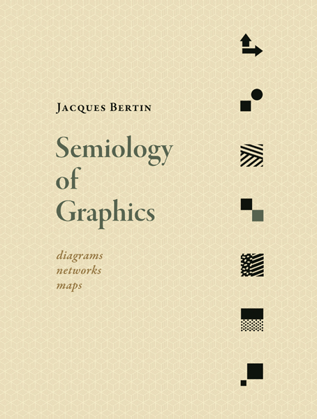
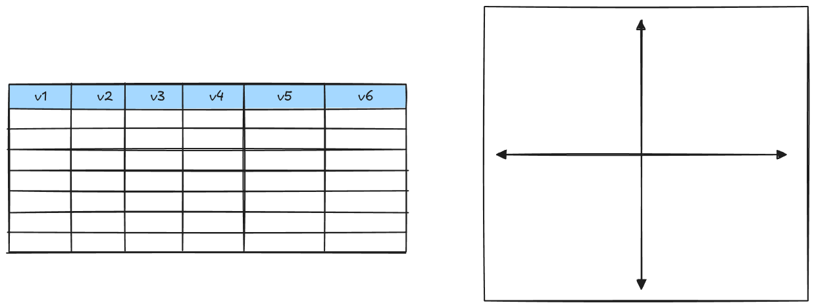
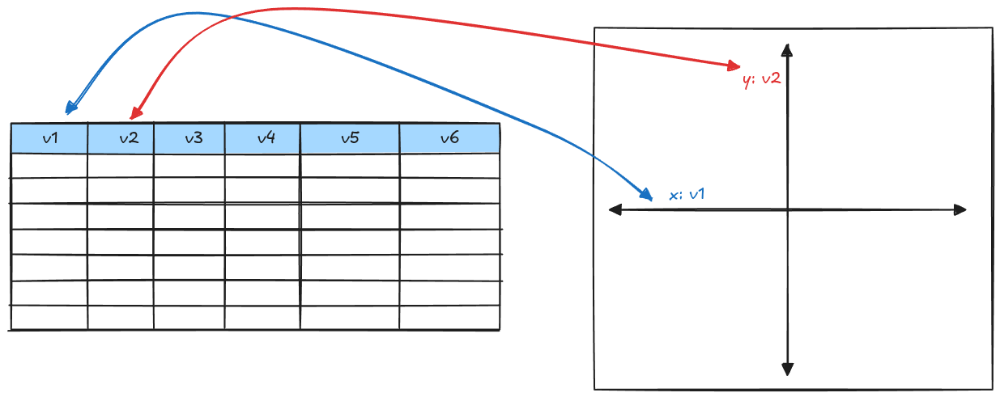
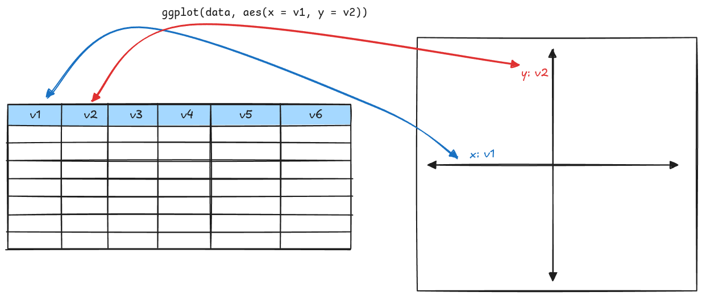

```{r}
library(ggplot2)
library(tidyverse)
theme_set(theme_bw())
```

## Categorizing Charts

::: {layout="[2, 3, 5]"}

](images/categorizing-graphics-1.png){fig-alt="A collection of charts, categorized by what they show: comparisons, correlations, part-to-whole and hierarchical groupings, temporal trends, distributions, and geospatial information"}

{fig-alt="The cover of *Semiology of Graphics* by Jacques Bertin."}

](images/data-to-viz-poster.png){fig-alt="A poster from data-to-viz.com showing an arrangement of different chart types by the data used to make them."}

:::

# The Grammar of Graphics

## The Grammar of Graphics

- A chart is like a single word 
  - "pie chart", "bar chart", "line chart", "scatter plot"
  - specific instance of a more general object
  - some charts that look similar are actually very different - e.g. a bar chart and a histogram.
  
- A **graphic** is a specification of the relationship between *visual forms* and *mathematical expressions*


## The Grammar of Graphics

A **grammar** of graphics is 

- a set of rules and conventions 
- to [describe]{.emph .blue .large} these [relationships]{.emph .sage-dk .large} 
- in a [structured]{.emph .aggie-blue .large} way

[We start with the data and the axes.]{.fragment}

## The Grammar of Graphics

{fig-alt="A data table with 6 variables, and a coordinate plane."}


## The Grammar of Graphics

{fig-alt="A data table with 6 variables, and a coordinate plane. Arrows show the mapping of v1 (the first column in the table) to the x-axis, and v2 (the second column in the table) to the y-axis. "}


## The Grammar of Graphics

{fig-alt="A data table with 6 variables, and a coordinate plane. Arrows show the mapping of v1 (the first column in the table) to the x-axis, and v2 (the second column in the table) to the y-axis. A ggplot command, `ggplot(data, aes(x = v1, y = v2))` is shown over the arrows."}

## The Grammar of Graphics

```{r}
#| echo: true
#| output-location: column
#| fig-width: 5
#| fig-height: 4
#| fig-alt: A blank canvas showing the x-axis, bill length, and the y-axis, flipper length. Nothing else is shown on the chart.
#| 
data("penguins")
library(ggplot2)

ggplot(
  penguins, 
  aes(x = bill_len, 
      y = flipper_len)
)
```

## The Grammar of Graphics

::: {.huge}

```
ggplot(
  data = <dataset>,
  aes(<mappings>)
) + 
  geom_function(
    aes(<additional mappings>), # <- This line is optional
    stat = <stat>, position = <position>) + 
  coordinate_function() + 
  facet_function() + 
  scale_function() + 
  theme_function()
```
:::

[You can layer multiple geoms together to get a more complicated graphic]{.fragment}

# Adding Things to the Plot

## Geometric Objects

Next, we specify the **geometric object** we want to use to show the data.

Each **geom** has required **aesthetic mappings** as well as optional mappings.

::: {layout="[3, 1]"}

| geom | required aesthetics | optional aesthetics |
| ---- | ------------------- | ------------------------ |
| point | x, y | color, shape, size, alpha |
| text | x, y, label | color, shape, size, angle, alpha, font family, font face, hjust, vjust |
| line | x, y | color, group, linetype, size |
| rect | xmin, xmax, ymin, ymax | color, fill, alpha, linetype, size |
| abline | intercept, slope | alpha, color, linetype, size |
| segment | x, y, xend, yend | alpha, color, linetype, size |
| bar | x | alpha, color, fill, linetype, size, weight |

 to see all the geoms and their required mappings](images/ggplot2-cheatsheet-page1.png){fig-alt="A screenshot of the ggplot2 cheat sheet available at https://opensource.posit.co/resources/cheatsheets/data-visualization/data-visualization.pdf"}
:::


## Geometric Objects

::: {layout="[2,2,2]" layout-valign="bottom"}

{fig-alt="A rectangle, with the lower left corner highlighted with an orange dot and orange text, (xmin, ymin), and the top right corner highlighted with a blue dot and text (xmax, ymax). There are arrows pointing at the border labeled color: border, linetype: border, size: border, and arrows pointing at the interior labeled alpha: transparency, fill: inside."}

{fig-alt="In the center of the figure, there is a word, label, sitting on top of a blue dot, with blue coordinates (x,y) underneath. An arrow points left to text: hjust: horizontal justification (alignment), 0=left, 0.5=center, 1=right. An arrow points  up from label, and says: vjust: vertical justification (alignment), 0=bottom, 0.5=center, 1=top. On the right of the figure, there is a horizontal line with a ray coming up from the left side, and on the ray there is text 'angle'. Below the label, there is a box with 'font family' written in several different fonts."}


:::

## Geometric Objects


```{r}
#| echo: true
#| output-location: column
#| fig-width: 5
#| fig-height: 4
#| fig-alt: A scatterplot showing the x-axis, bill length, and the y-axis, flipper length. 
#| 
data("penguins")
library(ggplot2)

ggplot(
  penguins, 
  aes(x = bill_len, 
      y = flipper_len)
) + 
  # aes is inherited from 
  # ggplot() statement
  geom_point()
```


## Geometric Objects


```{r}
#| echo: true
#| output-location: column
#| fig-width: 5
#| fig-height: 4
#| fig-alt: A scatterplot showing the x-axis, bill length, and the y-axis, flipper length. Points are colored by the species of the penguin.
#| 
data("penguins")
library(ggplot2)

ggplot(
  penguins, 
  aes(x = bill_len, 
      y = flipper_len, 
      color = species)
) + 
  # aes is inherited from 
  # ggplot() statement
  geom_point() 
```

- Choices of colors for each species are made automatically    
(but can be customized w/ more code)
- Legend appears automatically
- One line of code changes


## Position Adjustments

Arrange geoms that would otherwise use the same space

```{r}
#| echo: true
#| fig-width: 3
#| fig-height: 3
#| layout-ncol: 3
p <- ggplot(data = penguins, aes(x = species, fill = sex)) +
  theme(legend.position = "bottom")

p + geom_bar(position = "stack") + ggtitle("Position: Stack")
p + geom_bar(position = "dodge") + ggtitle("Position: Dodge")
p + geom_bar(position = "fill") + ggtitle("Position: Fill")
```


## Position Adjustments

Arrange geoms that would otherwise use the same space

```{r}
#| fig-width: 6
#| fig-height: 3
#| echo: true
#| layout-ncol: 2
#| fig-cap: ["Some points lie exactly on top of other points because data was recorded as integer measurements", "Jittering the point position allows a visual estimate of how many points overlap."]
p <- ggplot(penguins, 
            aes(x = flipper_len, y = bill_dep, 
                color = species)) + 
  guides(color = 'none')

p + geom_point(shape = 16, alpha = .5)
p + geom_point(shape = 16, alpha = .5, position = "jitter")
```


# Statistics

Sometimes, we want to compute [**statistics**]{.cerulean-dk} based on our data,
and map [**geoms**]{.sage-dk} to those computations.


## Statistics

Sometimes, we want to compute [**statistics**]{.cerulean-dk} based on our data,
and map [**geoms**]{.sage-dk} to those computations.

::: columns
::: {.column width="60%"}

[**Smooth** or **Trend** Line:]{.fragment fragment-index=1} [[stat_smooth()]{.cerulean-dk}]{.fragment fragment-index=2}

:::: {.fragment fragment-index=3}
::: {.sage-dk}
    geom_line(aes(x = after_stat(x),     
                  y = after_stat(y))) +    
    geom_ribbon(    
      aes(x = after_stat(x), 
          ymin = after_stat(ymin), 
          ymax = after_stat(ymax)))
:::
::::

[**Boxplots** (5-number summary):]{.fragment fragment-index=4} [[stat_boxplot()]{.cerulean-dk}]{.fragment fragment-index=5}

:::: {.fragment fragment-index=6}
::: {.sage-dk}
    geom_boxplot() 
    # A shortcut for something like this:
    geom_rect(aes(xmin = x - after_stat(width)/2,
                  xmax = x + after_stat(width)/2,
                  ymin = after_stat(lower),
                  ymax = after_stat(upper)) + 
    geom_segment(aes(x = x - after_stat(width)/2,
                     xend = x + after_stat(width)/2,
                     y = after_stat(middle),
                     yend = after_stat(middle))) + 
    geom_segment(aes(x = x, xend = xend, 
                     y = after_stat(lower),
                     yend = after_stat(ymin))) + 
    geom_segment(aes(x = x, xend = xend, 
                     y = after_stat(upper),
                     yend = after_stat(ymax)))
:::
::::

::: 
::: {.column width="40%"}

::: {.fragment fragment-index=3}

```{r}
#| fig-width: 6
#| fig-height: 3
#| echo: false
ggplot(penguins, aes(x = bill_len, y = flipper_len, color = species)) + geom_point() + geom_smooth(method = "lm", se = F) + guides(color="none")
```

:::

::: {.fragment fragment-index=6}

```{r}
#| fig-width: 6
#| fig-height: 3
#| echo: false
ggplot(penguins, aes(x = species, color = species, y = bill_len)) + geom_boxplot() + guides(color="none")
```

:::

:::

:::

## Statistics

Sometimes, we want to compute [**statistics**]{.cerulean-dk} based on our data,
and map [**geoms**]{.sage-dk} to those computations.

::: columns
::: {.column width="60%"}

[**bar plots** (count up data by category):]{.fragment fragment-index=1} [[stat_count()]{.cerulean-dk}]{.fragment fragment-index=2}

:::: {.fragment fragment-index=3}

::: {.sage-dk}
    geom_bar(aes(x = x, y = after_stat(count)))
    # A shortcut for something like this:
    geom_rect(aes(xmin = x - after_stat(width),
                  xmax = x + after_stat(width),
                  ymin = 0,
                  ymax = after_stat(count)))
:::
::::

[**Histograms** (cut into bins, then count):]{.fragment fragment-index=4} [[stat_bin()]{.cerulean-dk}]{.fragment fragment-index=5}

:::: {.fragment fragment-index=6}

::: {.sage-dk}
    geom_histogram(aes(x = x, y = after_stat(count)))
    # A shortcut for something like this:
    geom_rect(aes(xmin = after_stat(xstart),
                  xmax = after_stat(xend),
                  ymin = 0,
                  ymax = after_stat(count)))
:::
::::

[**Frequency Polygons** (cut into bins, then count):]{.fragment fragment-index=7} [[stat_bin()]{.cerulean-dk}]{.fragment fragment-index=8}

:::: {.fragment fragment-index=9}

::: {.sage-dk}
    geom_freqpoly(aes(x = x, y = after_stat(count)))
    # A shortcut for something like this:
    geom_line(aes(x = x,
                  y = after_stat(count)))
:::
::::

:::
::: {.column width="40%"}
::: {.fragment fragment-index=3}
```{r}
#| echo: false
#| fig-width: 6
#| fig-height: 2.5

ggplot(penguins, aes(x = species, fill = species)) + geom_bar() + 
  guides(fill = "none")
```
:::
::: {.fragment fragment-index=6}
```{r}
#| echo: false
#| fig-width: 6
#| fig-height: 2.5

ggplot(penguins, aes(x = bill_len)) + geom_histogram(fill = "grey", color = "black")
```
:::
::: {.fragment fragment-index=9}
```{r}
#| echo: false
#| fig-width: 6
#| fig-height: 2.5

ggplot(penguins, aes(x = bill_len, color = species)) + geom_freqpoly(stat="bin") + guides(color="none")
```
:::

:::
:::

## Statistics

Sometimes, we want to compute [**statistics**]{.cerulean-dk} based on our data,
and map [**geoms**]{.sage-dk} to those computations.

::: columns
::: {.column width="60%"}

[**density plots**:]{.fragment fragment-index=1} [[stat_density()]{.cerulean-dk}]{.fragment fragment-index=2}

:::: {.fragment fragment-index=3}

::: {.sage-dk}
    geom_density(aes(x = x, y = after_stat(density)))
    
    # A shortcut for something like this:
    geom_line(aes(x = x, y = after_stat(density)))
    
    # Or this (if fill is specified)
    geom_ribbon(aes(x = x, ymin = 0, ymax = after_stat(density)))
:::
::::

[**eCDF** (sort, calculate proportion <= each x value):]{.fragment fragment-index=4} [[stat_ecdf()]{.cerulean-dk}]{.fragment fragment-index=5}

:::: {.fragment fragment-index=6}

::: {.sage-dk}
    geom_step(aes(x = x, y = after_stat(count)))
    
    # A shortcut for something like this: 
    # Vertical piece
    geom_segment(aes(x = x_prev,
                     xend = x_prev,
                     y = after_stat(prop_prev),
                     yend = after_stat(prop))) + 
    # Horizontal piece
    geom_segment(aes(x = x_prev,
                     xend = x,
                     y = after_stat(prop),
                     yend = after_stat(prop)))          
:::
::::

:::
::: {.column width="40%"}

::: {.fragment fragment-index=3}
```{r}
#| echo: false
#| fig-width: 6
#| fig-height: 3

ggplot(data=penguins, aes(x = bill_len, color = species)) + geom_density() + guides(color="none")

```
:::
::: {.fragment fragment-index=6}
```{r}
#| echo: false
#| fig-width: 6
#| fig-height: 3

ggplot(data=penguins, aes(x = bill_len, color = species)) + stat_ecdf(geom="step") + guides(color="none")

```

:::

:::
:::

# Small Multiples
## Subplots (Facets)

When there are too many categorical variables, subplots can help!

```{r}
#| echo: true
#| output-location: column
#| fig-width: 4
#| fig-height: 4
ggplot(data = penguins,
       aes(x = body_mass, 
           y = bill_len, 
           color = sex)) + 
  geom_point() + 
  facet_wrap(~species, 
             ncol = 2) +
  guides(color = 'none')
```

- `facet_wrap()` - no ordering
- `facet_grid(rowvar ~ colvar)` - align in a grid

# Scales
## Scales

By default, `ggplot2` chooses reasonable default scales

::: {layout-ncol=2}

```{r}
#| fig-cap: "`geom_bar` uses `scale_x_discrete()`"
#| fig-width: 6
#| fig-height: 2.5
#| echo: false
ggplot(penguins, aes(x = sex, fill = sex)) + geom_bar() + guides(fill="none")
```

```{r}
#| fig-cap: "`geom_histogram` and `geom_density` use `scale_x_continuous()`"
#| fig-width: 6
#| fig-height: 2.5
#| echo: false
ggplot(penguins, aes(x = flipper_len, fill = species)) + geom_histogram(color="black") + guides(fill="none")
```

:::

- `scale_{aesthetic}_{type}`
  - aesthetic can be x, y, fill, color, shape, etc., 


## Scale Types
  - `manual` - available for almost all scales
  - position (x, y): `continuous`, `discrete`, `date`, `datetime`
    - transforms: `scale_*_log10`, `scale_*_reverse`, `scale_*_sqrt`
    

```{r}
#| fig-width: 12
#| fig-height: 1
demo <- data.frame(x = seq(0, 100, 5))
library(patchwork)
p1 <- ggplot(data = demo, aes(x = x)) + geom_rug(length=unit(.5, "npc")) + xlab("scale_x_continuous()")
p2 <- ggplot(data = demo, aes(x = x)) + geom_rug(length=unit(.5, "npc")) + scale_x_sqrt() + xlab("scale_x_sqrt()")
p3 <- ggplot(data = demo, aes(x = x)) + geom_rug(length=unit(.5, "npc"))  + scale_x_log10() + xlab("scale_x_log10()")
p1+p2+p3
```

Color/fill have special scales:

  - discrete: `scale_*_brewer`, `scale_*_grey`
    

```{r}
#| fig-width: 12
#| fig-height: .75
demo <- data.frame(x = 1:12, y = 1, fill = factor(1:12), fillcts = 1:12)
library(patchwork)
library(tayloRswift)
library(ggsci)
p1 <- ggplot(data = demo, aes(xmin = x-.75, xmax = x, ymin = y-.75, ymax=y, fill = fill)) + geom_rect() + scale_fill_brewer(palette = "Paired") + guides(fill = "none") + xlab("Brewer: Paired") + theme(axis.text=element_blank(), axis.ticks=element_blank(), panel.grid = element_blank())
p2 <- ggplot(data = demo, aes(xmin = x-.75, xmax = x, ymin = y-.75, ymax=y, fill = fill)) + geom_rect() + scale_fill_simpsons() + guides(fill = "none") + xlab("ggsci: Simpsons") + theme(axis.text=element_blank(), axis.ticks=element_blank(), panel.grid = element_blank())
p3 <- ggplot(data = demo, aes(xmin = x-.75, xmax = x, ymin = y-.75, ymax=y, fill = fill)) + geom_rect() + scale_fill_taylor(palette="lover", discrete=TRUE) + guides(fill = "none") + xlab("Taylor: Lover") + theme(axis.text=element_blank(), axis.ticks=element_blank(), panel.grid = element_blank())
p1+p2+p3
```
  
  [`tayloRswift` has album-themed color palettes. <br/>`ggsci` has palettes from Futurama, Simsons, StarTrek, Tron, Rick and Morty and various news outlets]{.fragment .emph}    


## Scale Types

Color/fill have special scales:

- discrete: `scale_*_brewer`, `scale_*_grey`
- continuous: `scale_*_distiller` (discrete scale interpolated), `scale_*_gradient` (low to high), `scale_*_gradient2` (bidirectional)
   - "trans" argument to add a transformation (`log10` is useful)
   
- Palette choices:
  - [ColorBrewer](https://colorbrewer2.org/) has palettes for maps
  - [Color Palette Finder](https://r-graph-gallery.com/color-palette-finder?s=09) applet

```{r}
#| fig-width: 12
#| fig-height: .75
demo <- data.frame(x = 1:12, y = 1, fill = factor(1:12), fillcts = 1:12)
library(viridis)
p1 <- ggplot(data = demo, aes(xmin = x-.75, xmax = x, ymin = y-.75, ymax=y, fill = fillcts)) + geom_rect() + scale_fill_distiller(palette = "Greens") + guides(fill = "none") + xlab("ColorBrewer: Greens") + theme(axis.text=element_blank(), axis.ticks=element_blank(), panel.grid = element_blank())
p2 <- ggplot(data = demo, aes(xmin = x-.75, xmax = x, ymin = y-.75, ymax=y, fill = fillcts)) + geom_rect() + scale_fill_distiller(palette = "PuOr") + guides(fill = "none") + xlab("Brewer: PuOr") + theme(axis.text=element_blank(), axis.ticks=element_blank(), panel.grid = element_blank())
p3 <- ggplot(data = demo, aes(xmin = x-.75, xmax = x, ymin = y-.75, ymax=y, fill = fillcts)) + geom_rect() + scale_fill_viridis(option="plasma") + guides(fill = "none") + xlab("Viridis: Plasma") + theme(axis.text=element_blank(), axis.ticks=element_blank(), panel.grid = element_blank())
p1+p2+p3
```
[We'll talk more about color next time]{.fragment .emph .blue}

## Coordinate Systems
`+ coord_xxx()`

- Cartesian: Standard x and y axis
- Fixed: Ensure there is a fixed aspect ratio
- Flip: swap x and y axes
- Polar: specify which variable (x, y) is the angle (theta)
- Trans: specify x or y axis transformations
